```mermaid
%%{init: {'theme': 'dark', 'themeVariables': { 'primaryColor': '#0891b2', 'primaryTextColor': '#fff', 'primaryBorderColor': '#06b6d4', 'lineColor': '#06b6d4', 'secondaryColor': '#1e1e2e', 'tertiaryColor': '#1e1e2e'}}}%%
flowchart TB
    subgraph UI["🖥️ User Interface Layer"]
        ST[Streamlit App<br/>📊 Interactive UI]
        API[FastAPI REST<br/>⚡ Async Endpoints]
    end

    subgraph ORCH["🔄 LangGraph Orchestration"]
        LG[State Machine<br/>🔗 Pipeline Flow]
        CL[Celery Workers<br/>⏳ Async Tasks]
    end

    subgraph AGENTS["🤖 Multi-Agent System"]
        direction TB
        PA[🔍 Profiler]
        CA[🧹 Cleaner]
        FA[🔧 Feature Eng.]
        VA[📊 Visualizer]
        MA[🤖 Modeler]
        EA[💡 Explainer]
    end

    subgraph LLM["🧠 LLM Layer"]
        OL[Ollama<br/>Llama 3.1]
        GQ[Groq API<br/>Cloud LLM]
    end

    subgraph RL["🎯 RL Model Selector"]
        MF[Meta-Features<br/>30+ Statistics]
        PPO[PPO Agent<br/>Optimal Selection]
    end

    subgraph ML["⚙️ ML Engine"]
        PC[PyCaret AutoML]
        OP[Optuna HPO]
        ENS[Ensemble Models]
    end

    subgraph DATA["💾 Data Layer"]
        PG[(PostgreSQL)]
        RD[(Redis)]
        QD[(Qdrant)]
        FS[(Feast)]
    end

    subgraph MLOPS["📦 MLOps"]
        MLF[MLflow Tracking]
        DVC[DVC Versioning]
    end

    UI --> ORCH
    ORCH --> AGENTS
    AGENTS --> LLM
    AGENTS --> RL
    RL --> ML
    ML --> DATA
    ML --> MLOPS
```

<div align="center">

<!-- Dynamic Header with Animated Gradient -->


<br/>

<!-- Typing SVG Effect -->
<a href="https://git.io/typing-svg"></a>

<br/>

<!-- Tech Stack Badges - Clean Grid -->
<p>


</p>

<br/>

<!-- Navigation Pills -->
<p>
<a href="#-about-the-developer"></a>
<a href="#-skills-showcase"></a>
<a href="#-tech-stack-deep-dive"></a>
<a href="#-system-architecture"></a>
<a href="#-quick-start"></a>
</p>

---


</div>

## 👨‍💻 About the Developer

<table>
<tr>
<td width="60%">

### **Shivaraj Senthil Rajan**


🎓 **MS in Data Science** — *University of Colorado Boulder*

Building intelligent systems that transform complex data science workflows into autonomous, production-ready solutions through multi-agent AI, LLM orchestration, and reinforcement learning.

<br/>

📧 **[Shivaraj.SenthilRajan@colorado.edu](mailto:Shivaraj.SenthilRajan@colorado.edu)**

</td>
<td width="40%" align="center">

[](https://github.com/Shiva250503ss)

[](https://www.linkedin.com/in/shivaraj-senthil-rajan-2b8898227/)

[](https://shiva250503ss.github.io/shivaraj-portfolio/)

</td>
</tr>
</table>

---

## 🎯 Skills Showcase

<div align="center">

> *This project demonstrates comprehensive skills across all four major data roles, showcasing production-ready expertise in modern AI/ML technologies.*

</div>

<table>
<tr>
<td width="25%" valign="top">

### 📊 Data Analyst

<div align="center">

</div>

```
🔍 Automated EDA Generation
📈 Interactive Dashboards
📊 Statistical Analysis
🎨 Smart Visualizations
📋 Data Quality Reports
💡 Insight Extraction
🔗 Correlation Analysis
📉 Distribution Profiling
```

**Tools Used:**
`Plotly` `Streamlit` `Pandas`
`Matplotlib` `Seaborn` `Stats`

</td>
<td width="25%" valign="top">

### 🧠 Data Scientist

<div align="center">

</div>

```
🔧 Feature Engineering
🤖 AutoML Integration
🎯 Model Selection (RL)
📊 Ensemble Methods
⚡ Hyperparameter Tuning
💡 SHAP/LIME Explainability  
📈 Cross-Validation
🔄 SMOTE/ADASYN Balancing
```

**Tools Used:**
`PyCaret` `XGBoost` `LightGBM`
`Optuna` `SHAP` `scikit-learn`

</td>
<td width="25%" valign="top">

### 🔧 Data Engineer

<div align="center">

</div>

```
🔄 ETL Data Pipelines
✅ Data Validation
🗄️ Feature Store (Feast)
💾 PostgreSQL/Redis
⚡ Async Processing
📦 Data Versioning (DVC)
🔍 Schema Validation
🌐 REST API Design
```

**Tools Used:**
`PostgreSQL` `Redis` `Qdrant`
`Great Expectations` `Feast`

</td>
<td width="25%" valign="top">

### 🤖 AI Engineer

<div align="center">

</div>

```
🤖 Multi-Agent Systems
🔗 LangGraph Orchestration
🧠 LLM Integration
🎯 Reinforcement Learning
⚡ Prompt Engineering
🔄 State Machine Design
📦 Model Serving
🐳 MLOps Pipelines
```

**Tools Used:**
`LangGraph` `Ollama` `PyTorch`
`Stable-Baselines3` `MLflow`

</td>
</tr>
</table>

---

## 🌟 Project Highlights

<div align="center">

| 🤖 **Multi-Agent AI** | 🎯 **Reinforcement Learning** | 📊 **Data Engineering** | ☁️ **MLOps Ready** |
|:---:|:---:|:---:|:---:|
| 6 Specialized AI Agents | PPO-Based Model Selection | ETL + Validation Pipelines | MLflow Experiment Tracking |
| LangGraph State Machine | 30+ Meta-Features | Great Expectations | Docker Multi-Service |
| Ollama/Groq LLM Backend | Gymnasium Environment | Feast Feature Store | DVC Data Versioning |

</div>

---

## 🛠️ Tech Stack Deep Dive

<details open>
<summary><h3>🤖 AI & LLM Technologies</h3></summary>

<table>
<tr>
<td>

| Technology | Purpose | Implementation |
|:---|:---|:---|
| **LangGraph** | Multi-agent orchestration | State machine pipeline with 6 agents |
| **LangChain 0.3** | LLM framework | Prompt templates, chains, memory |
| **Ollama + Llama 3.1** | Local LLM inference | Zero-cost, privacy-first AI |
| **Groq API** | Cloud LLM fallback | Ultra-fast inference option |
| **SHAP** | Model explainability | Global & local feature importance |
| **LIME** | Instance explanations | Human-readable interpretability |

</td>
</tr>
</table>

<p align="center">


</p>

</details>

<details>
<summary><h3>🎯 Reinforcement Learning Stack</h3></summary>

<table>
<tr>
<td>

| Technology | Purpose | Implementation |
|:---|:---|:---|
| **Stable-Baselines3** | RL algorithms | PPO agent for model selection |
| **Gymnasium** | RL environment | Custom ModelSelectionEnv |
| **PyTorch** | Neural networks | Policy network training |
| **Meta-Features** | Dataset fingerprinting | 30+ statistical features |

</td>
</tr>
</table>

<p align="center">


</p>

</details>

<details>
<summary><h3>⚙️ Machine Learning & AutoML</h3></summary>

<table>
<tr>
<td>

| Technology | Purpose | Implementation |
|:---|:---|:---|
| **PyCaret** | AutoML framework | Automated model comparison |
| **Optuna** | Hyperparameter tuning | 50 trials per model |
| **XGBoost** | Gradient boosting | High-performance predictions |
| **LightGBM** | Fast GBM | Large dataset handling |
| **CatBoost** | Categorical handling | Native category encoding |
| **scikit-learn** | ML fundamentals | Preprocessing, metrics, CV |
| **imbalanced-learn** | Class imbalance | SMOTE, ADASYN resampling |

</td>
</tr>
</table>

<p align="center">


</p>

</details>

<details>
<summary><h3>🔄 Backend & API Infrastructure</h3></summary>

<table>
<tr>
<td>

| Technology | Purpose | Implementation |
|:---|:---|:---|
| **FastAPI 0.115** | REST API framework | Async endpoints, auto-docs |
| **Celery** | Async task queue | Long-running ML jobs |
| **Pydantic v2** | Data validation | Type-safe API payloads |
| **Uvicorn** | ASGI server | Production-ready serving |
| **HTTPX** | Async HTTP client | External API calls |

</td>
</tr>
</table>

<p align="center">


</p>

</details>

<details>
<summary><h3>🖥️ Frontend & Visualization</h3></summary>

<table>
<tr>
<td>

| Technology | Purpose | Implementation |
|:---|:---|:---|
| **Streamlit 1.40** | Interactive UI | Multi-page data app |
| **Plotly** | Interactive charts | 3D plots, animations |
| **Matplotlib** | Static plots | Publication-quality figures |
| **Seaborn** | Statistical plots | Distribution, correlation |

</td>
</tr>
</table>

<p align="center">


</p>

</details>

<details>
<summary><h3>💾 Database & Storage Layer</h3></summary>

<table>
<tr>
<td>

| Technology | Purpose | Implementation |
|:---|:---|:---|
| **PostgreSQL 16** | Primary database | ML metadata, user data |
| **Redis 7** | Caching layer | Session, async results |
| **Qdrant** | Vector database | Embedding similarity search |
| **Feast** | Feature store | Centralized feature serving |
| **SQLAlchemy 2** | ORM | Database abstraction |

</td>
</tr>
</table>

<p align="center">


</p>

</details>

<details>
<summary><h3>📦 MLOps & DevOps</h3></summary>

<table>
<tr>
<td>

| Technology | Purpose | Implementation |
|:---|:---|:---|
| **MLflow** | Experiment tracking | Metrics, parameters, models |
| **DVC** | Data versioning | Dataset reproducibility |
| **BentoML** | Model serving | Containerized inference |
| **Docker Compose** | Multi-service | 7-container orchestration |
| **GitHub Actions** | CI/CD | Automated testing, deploy |

</td>
</tr>
</table>

<p align="center">


</p>

</details>

<details>
<summary><h3>✅ Data Quality & Validation</h3></summary>

<table>
<tr>
<td>

| Technology | Purpose | Implementation |
|:---|:---|:---|
| **Great Expectations** | Data validation | Expectation suites |
| **Pandera** | Schema validation | DataFrame type checking |
| **Prefect** | Workflow orchestration | Pipeline scheduling |

</td>
</tr>
</table>

<p align="center">


</p>

</details>

---

## 🏗️ System Architecture



---

## 📊 Pipeline Flow

```mermaid
%%{init: {'theme': 'dark'}}%%
stateDiagram-v2
    [*] --> START: 📤 Upload Data
    START --> PROFILE: 🔍 Analyze
    PROFILE --> PLAN: 📋 Strategize
    PLAN --> CLEAN: 🧹 Clean
    CLEAN --> FEATURE: 🔧 Engineer
    FEATURE --> VISUALIZE: 📈 EDA
    VISUALIZE --> RL_SELECT: 🎯 RL Select
    RL_SELECT --> MODEL: 🤖 Train
    MODEL --> EXPLAIN: 💡 Explain
    EXPLAIN --> COMPLETE: ✅ Package
    COMPLETE --> [*]
```

<div align="center">



</div>

| Stage | Agent | Input | Output | Key Operations |
|:---:|:---:|:---|:---|:---|
| 🚀 **START** | - | Raw file | DataFrame | Schema detection, type inference |
| 🔍 **PROFILE** | Profiler | DataFrame | Profile report | Statistics, distributions, target detection |
| 📋 **PLAN** | LLM | Profile | Strategy | Pipeline planning via LangGraph |
| 🧹 **CLEAN** | Cleaner | Data | Clean data | Missing values, outliers, duplicates |
| 🔧 **FEATURE** | Feature | Clean data | Features | Engineering, encoding, scaling, selection |
| 📈 **VISUALIZE** | Visualizer | Features | Charts | Smart EDA, correlations, insights |
| 🎯 **RL_SELECT** | PPO | Meta-features | Models | Top 3 model selection via RL |
| 🤖 **MODEL** | Modeler | Features | Ensemble | Training, tuning, ensemble creation |
| 💡 **EXPLAIN** | Explainer | Models | Explanations | SHAP, LIME, natural language |
| ✅ **COMPLETE** | - | All | Report | Package results, export models |

---

## 🤖 The Six AI Agents

<div align="center">

```
┌─────────────────────────────────────────────────────────────────────────────────┐
│                         🤖 DATAPILOT MULTI-AGENT SYSTEM                         │
├─────────────────────────────────────────────────────────────────────────────────┤
│                                                                                 │
│    ┌──────────────┐    ┌──────────────┐    ┌──────────────┐                    │
│    │  🔍 PROFILER │───▶│  🧹 CLEANER  │───▶│  🔧 FEATURE  │                    │
│    │              │    │              │    │              │                    │
│    │ • Statistics │    │ • Missing    │    │ • Encoding   │                    │
│    │ • Quality    │    │ • Outliers   │    │ • Scaling    │                    │
│    │ • Target     │    │ • Duplicates │    │ • Selection  │                    │
│    └──────────────┘    └──────────────┘    └──────────────┘                    │
│           │                                        │                            │
│           │              LangGraph                 │                            │
│           └────────────▶ Orchestration ◀───────────┘                            │
│                               │                                                 │
│    ┌──────────────┐    ┌──────────────┐    ┌──────────────┐                    │
│    │ 📊 VISUALIZER│◀───│  🤖 MODELER  │◀───│ 💡 EXPLAINER │                    │
│    │              │    │              │    │              │                    │
│    │ • Charts     │    │ • Training   │    │ • SHAP       │                    │
│    │ • EDA        │    │ • Ensemble   │    │ • LIME       │                    │
│    │ • Insights   │    │ • Tuning     │    │ • NL Summary │                    │
│    └──────────────┘    └──────────────┘    └──────────────┘                    │
│                                                                                 │
└─────────────────────────────────────────────────────────────────────────────────┘
```

</div>

---

## 📁 Project Structure

```
DataPilotAI/
│
├── 🎨 src/                           # Main Source Code
│   ├── agents/                       # 🤖 Multi-Agent System
│   │   ├── base_agent.py            # Base agent class with LLM integration
│   │   ├── profiler_agent.py        # Data profiling & quality analysis
│   │   ├── cleaner_agent.py         # Missing values, outliers, duplicates
│   │   ├── feature_agent.py         # Feature engineering & selection
│   │   ├── visualization_agent.py   # Smart EDA & chart generation
│   │   ├── modeler_agent.py         # Model training & ensemble
│   │   └── explainer_agent.py       # SHAP, LIME, explanations
│   │
│   ├── rl_selector/                  # 🎯 Reinforcement Learning
│   │   ├── meta_features.py         # 30+ statistical feature extraction
│   │   ├── ppo_agent.py             # PPO policy network & training
│   │   ├── model_env.py             # Gymnasium environment
│   │   └── model_pool.py            # Available model registry
│   │
│   ├── pipelines/                    # 🔗 LangGraph Orchestration
│   │   ├── state_machine.py         # Pipeline state machine
│   │   ├── chat_mode.py             # Autonomous execution mode
│   │   └── guided_mode.py           # Interactive step-by-step mode
│   │
│   ├── api/                          # ⚡ FastAPI Backend
│   │   └── main.py                  # REST API endpoints
│   │
│   └── ui/                           # 🖥️ Streamlit Frontend
│       └── app.py                   # Interactive data science UI
│
├── 🐳 docker-compose.yml             # Multi-service orchestration (7 containers)
├── 📦 requirements.txt               # Python dependencies
├── 📄 Dockerfile                     # Container build instructions
└── 📄 README.md                      # This documentation
```

---

## 🚀 Quick Start

### Prerequisites

```bash
# Required
Python >= 3.10
Docker & Docker Compose
Ollama (for local LLM)
```

### 🐳 Docker (Recommended)

```bash
# Clone the repository
git clone https://github.com/Shiva250503ss/DataPilot-AI.git
cd DataPilot-AI

# Start all services (7 containers)
docker-compose up -d

# Access the platform
# 🖥️ Streamlit UI:    http://localhost:8501
# ⚡ FastAPI Docs:    http://localhost:8000/docs
# 📊 MLflow UI:       http://localhost:5000
```

### 💻 Manual Setup

```bash
# Create virtual environment
python -m venv venv
source venv/bin/activate  # Windows: venv\Scripts\activate

# Install dependencies
pip install -r requirements.txt

# Start Ollama with Llama 3.1
ollama serve
ollama pull llama3.1

# Start backend (terminal 1)
cd src/api && uvicorn main:app --reload

# Start frontend (terminal 2)
cd src/ui && streamlit run app.py
```

---

## 📈 Performance Metrics

<div align="center">

| Metric | Value | Notes |
|:---|:---:|:---|
| **Pipeline Execution** | ~5-15 min | Depends on dataset size |
| **RL Model Selection Accuracy** | 87% | Optimal model chosen |
| **Ensemble Lift** | +3-8% | Over single best model |
| **Max Dataset Size** | 1M+ rows | Async processing |
| **Concurrent Users** | 10+ | Celery task queue |

</div>

---

## 🗺️ Roadmap

- [x] Multi-agent architecture with LangGraph state machine
- [x] RL-based model selection with Stable-Baselines3 PPO
- [x] Ensemble methods (Voting, Stacking, Weighted)
- [x] SHAP/LIME explainability integration
- [x] Docker multi-service deployment
- [ ] Cloud deployment (AWS SageMaker / GCP Vertex AI)
- [ ] Real-time prediction API with BentoML
- [ ] Time series forecasting agent
- [ ] Custom agent training interface

---

## 📞 Connect With Me

<div align="center">

<a href="mailto:Shivaraj.SenthilRajan@colorado.edu">

</a>

<a href="https://www.linkedin.com/in/shivaraj-senthil-rajan-2b8898227/">

</a>

<a href="https://github.com/Shiva250503ss">

</a>

<a href="https://shiva250503ss.github.io/shivaraj-portfolio/">

</a>

</div>

---

<div align="center">

### 💼 Open to Opportunities


*Passionate about leveraging multi-agent AI, LLM orchestration, and reinforcement learning to build production-ready data solutions that drive real business impact.*

---


**⭐ If this project inspired you, consider giving it a star!**


*Built with ❤️ by Shivaraj Senthil Rajan*

</div>

https://github.com/Shiva250503ss/DataPilot-AI
--------------------------

https://github.com/Shiva250503ss/Virtual_Try_On

# 👔 Deep Virtual Try-On with Clothes Transform
### *Next-Gen Fashion Tech: Context-Aware Generative Adversarial Networks*

[](https://pytorch.org/)
[](https://www.python.org/)
[](https://opencv.org/)
[](https://en.wikipedia.org/wiki/Generative_adversarial_network)

---

## �‍💻 Author Profile
**Shivaraj Senthil Rajan**  
*Data Scientist | AI Engineer | Computer Vision Specialist*

[](https://www.linkedin.com/in/shivaraj-senthil-rajan-2b8898227/)
[](https://github.com/Shiva250503ss)
📧 [Shivaraj.SenthilRajan@colorado.edu](mailto:Shivaraj.SenthilRajan@colorado.edu)
🌐 [Portfolio](https://shiva250503ss.github.io/shivaraj-portfolio/)

---

## 🚀 Executive Summary
This project implements an end-to-end **Deep Learning pipeline for Virtual Try-On (VTON)**, tackling the complex challenge of fitting 2D garment images onto person images while preserving texture, shape, and realistic deformations.

Leveraging **Generative Adversarial Networks (GANs)** and **Thin-Plate Spline (TPS) transformation**, this system enables realistic high-fidelity synthesis suitable for e-commerce applications. The architecture demonstrates advanced capabilities in **Computer Vision**, **Semantic Segmentation**, and **Image-to-Image Translation**.

---

## 🛠️ Key Technologies & Skills Demonstrated

### 🧠 **AI & Deep Learning Engineering**
*   **Architectures**: Implemented and compared multiple SOTA architectures:
    *   **PRGAN** (Pose-Guided Residual GAN)
    *   **CAGAN** (Context-Aware GAN)
    *   **CRN** (Cascaded Refinement Network)
    *   **VITON** (Virtual Try-On Network with TPS Warping)
*   **Generative AI**: Utilized adversarial training (GANs) with patch-based discriminators and hinge loss optimization.
*   **Computer Vision**:
    *   **Geometric Deep Learning**: TPS (Thin Plate Spline) Warping for non-rigid garment deformation.
    *   **Semantic Segmentation**: DeepLabV3 integration for parsing human body parts.
    *   **Pose Estimation**: MediaPipe/OpenPose integration for skeleton-aware synthesis.
*   **Loss Function Engineering**: Custom implementation of Perceptual Loss (VGG16 features), L1 Reconstruction Loss, and Adversarial Hinge Loss.

### 📊 **Data Science & Analytics**
*   **Model Evaluation**: rigorous A/B testing framework using industry-standard metrics:
    *   **SSIM** (Structural Similarity Index) for reconstruction fidelity.
    *   **Inception Score (IS)** for generation quality.
    *   **IoU** (Intersection over Union) for mask alignment accuracy.
*   **Ablation Studies**: Systematic analysis of model components (e.g., verifying the impact of refinement stages and warping modules).
*   **Data Pipeline**: Robust `DataLoader` implementation handling paired datasets, dynamic masking, and on-the-fly transformations.

### ⚙️ **Data Engineering & MLOps**
*   **Modular Design**: Clean, scalable codebase separating `models`, `data`, `utils`, and `scripts`.
*   **Configuration Management**: YAML-based experiment tracking for reproducible research.
*   **Optimization**:
    *   Mixed-precision training ready.
    *   Efficient GPU utilization with optimized tensor operations.
    *   Automated checkpointing and state restoration.

---

## 📸 Results Checklist

| Model Capability | Status | Description |
|-----------------|--------|-------------|
| **Garment Warping** | ✅ | Deforms clothes to fit body shape |
| **Texture Preservation** | ✅ | Maintains logo and pattern details |
| **Skin Generation** | ✅ | Reconstructs skin in occluded areas |
| **Multi-Pose Support** | ✅ | Handles various user poses |


*(Generated comparison showing Input Person, Garment, Agnostic representation, and Final Result)*

---

## 💻 Installation & Usage

### Prerequisites
*   Windows/Linux/MacOS
*   Python 3.10+
*   NVIDIA GPU (Recommended for training)

### Quick Start
I have standardized the project entry point for ease of use.

1.  **Clone & Setup**:
    ```bash
    git clone https://github.com/Shiva250503ss/Deep-Virtual-Try-on.git
    pip install -r requirements.txt  # or conda env create -f env.yml
    ```

2.  **Run the Unified Runner**:
    ```bash
    # Test system integrity
    python run.py test
    
    # Run Inference Demo (Try PRGAN model)
    python run.py demo prgan
    
    # Train a new model (e.g., VITON)
    python run.py train viton
    ```

### Engineering Workflow
The project follows a standard machine learning lifecycle:
1.  **Data Ingestion**: `data/dataset.py` processes raw images and parses semantic maps.
2.  **Training Loop**: `scripts/train.py` handles forward passes, loss computation, and backpropagation.
3.  **Validation**: `scripts/evaluate.py` runs inference on test sets and logs metrics.
4.  **Inference**: `demo.py` provides a user-facing interface for prediction.

---

## 📂 Project Structure

```bash
├── models/             # 🧠 Neural Network Definitions (PyTorch)
│   ├── viton.py       # Main Virtual Try-On Network
│   ├── warper_tps.py  # Geometric Warping Module
│   └── ...
├── data/               # 💾 ETL & Data Loading Pipelines
│   └── dataset.py     # Custom PyTorch Dataset
├── utils/              # 📐 Metrics & Loss Functions
│   ├── losses.py      # Perceptual & GAN Losses
│   └── metrics.py     # SSIM, IoU Calculation
├── scripts/            # 🔄 Training & Evaluation Workflow
├── config.yaml         # ⚙️ Hyperparameter Configuration
└── run.py              # 🚀 CLI Entry Point
```

---

## 📜 License
This project is open-source and available for educational and portfolios purposes.

---
*Built with ❤️ by Shivaraj Senthil Rajan using PyTorch & Computer Vision*

---------------------------------
<div align="center">

# 🌾 Smart Field
### *Cultivating Tomorrow's Harvest with AI & Data Science*

[](https://python.org)
[](https://pytorch.org)
[](https://scikit-learn.org)
[](https://flask.palletsprojects.com)
[](https://pandas.pydata.org)
[](https://numpy.org)


<br/>

[](https://github.com/Shiva250503ss)
[](https://www.linkedin.com/in/shivaraj-senthil-rajan-2b8898227/)
[](https://shiva250503ss.github.io/shivaraj-portfolio/)
[](mailto:Shivaraj.SenthilRajan@colorado.edu)

---

**An end-to-end Machine Learning solution for precision agriculture, combining Deep Learning image classification, predictive analytics, and real-time IoT data integration to empower data-driven farming decisions.**

[Features](#-core-features) • [Tech Stack](#-technology-stack) • [ML Models](#-machine-learning-architecture) • [Demo](#-application-demo) • [Installation](#-quick-start)

</div>

---

## 🎯 Project Highlights

<table>
<tr>
<td width="50%">

### 🔬 Data Science & ML
- **Deep Learning** model with ResNet9 architecture
- **38-class image classification** for plant diseases
- **Random Forest** predictive modeling for crop recommendations
- **Feature Engineering** with 7 environmental parameters
- **Real-time API integration** for weather data

</td>
<td width="50%">

### 📊 Data Engineering & Analytics
- **ETL Pipeline** for agricultural data processing
- **RESTful API** architecture with Flask
- **Structured data management** with Pandas
- **IoT sensor data integration** capabilities
- **Production deployment** with Gunicorn WSGI

</td>
</tr>
</table>

---

## 🛠️ Technology Stack

<div align="center">

### 🤖 Machine Learning & AI
| Category | Technologies |
|:--------:|:------------|
| **Deep Learning** |   |
| **Machine Learning** |   |
| **Computer Vision** |   |

### 📊 Data Engineering & Analytics
| Category | Technologies |
|:--------:|:------------|
| **Data Processing** |   |
| **Data Serialization** |   |
| **API Integration** |   |

### 🌐 Backend & Deployment
| Category | Technologies |
|:--------:|:------------|
| **Framework** |   |
| **Server** |   |
| **Frontend** |     |

</div>

---

## 🧠 Machine Learning Architecture

### 1️⃣ Plant Disease Detection — Deep Learning CNN

```
┌─────────────────────────────────────────────────────────────────────────────┐
│                         🔬 ResNet9 Architecture                              │
├─────────────────────────────────────────────────────────────────────────────┤
│                                                                              │
│   Input Image (256x256x3)                                                    │
│         │                                                                    │
│         ▼                                                                    │
│   ┌───────────────┐    ┌───────────────┐    ┌───────────────┐               │
│   │   Conv Block  │───▶│ Residual Block│───▶│   Conv Block  │               │
│   │   64 filters  │    │   128 filters │    │  256 filters  │               │
│   └───────────────┘    └───────────────┘    └───────────────┘               │
│         │                                          │                         │
│         │              ┌───────────────┐           │                         │
│         └─────────────▶│ Residual Block│◀──────────┘                         │
│                        │  512 filters  │                                     │
│                        └───────┬───────┘                                     │
│                                │                                             │
│                                ▼                                             │
│                    ┌─────────────────────┐                                   │
│                    │   Classification    │                                   │
│                    │    (38 Classes)     │                                   │
│                    └─────────────────────┘                                   │
│                                                                              │
│   Features: BatchNorm • ReLU • MaxPooling • Residual Connections            │
└─────────────────────────────────────────────────────────────────────────────┘
```

<details>
<summary><b>🌿 Supported Disease Classes (38 Classes across 14 Crops)</b></summary>

| Crop | Diseases Detected |
|:----:|:------------------|
| 🍎 **Apple** | Scab, Black Rot, Cedar Apple Rust, Healthy |
| 🍇 **Grape** | Black Rot, Esca (Black Measles), Leaf Blight, Healthy |
| 🍅 **Tomato** | Bacterial Spot, Early Blight, Late Blight, Leaf Mold, Septoria Leaf Spot, Spider Mites, Target Spot, Yellow Leaf Curl Virus, Mosaic Virus, Healthy |
| 🥔 **Potato** | Early Blight, Late Blight, Healthy |
| 🌽 **Corn** | Cercospora Leaf Spot, Common Rust, Northern Leaf Blight, Healthy |
| 🍒 **Cherry** | Powdery Mildew, Healthy |
| 🫑 **Pepper** | Bacterial Spot, Healthy |
| 🍊 **Orange** | Haunglongbing (Citrus Greening) |
| 🍑 **Peach** | Bacterial Spot, Healthy |
| 🫐 **Blueberry** | Healthy |
| 🍓 **Strawberry** | Leaf Scorch, Healthy |
| 🎃 **Squash** | Powdery Mildew |
| 🌱 **Soybean** | Healthy |
| 🍇 **Raspberry** | Healthy |

</details>

---

### 2️⃣ Crop Recommendation — Random Forest Classifier

```
┌──────────────────────────────────────────────────────────────────────────────┐
│                    📊 Feature Engineering Pipeline                            │
├──────────────────────────────────────────────────────────────────────────────┤
│                                                                               │
│   ┌─────────────┐    ┌─────────────┐    ┌─────────────┐                      │
│   │  Nitrogen   │    │ Phosphorous │    │  Potassium  │                      │
│   │     (N)     │    │     (P)     │    │     (K)     │                      │
│   └──────┬──────┘    └──────┬──────┘    └──────┬──────┘                      │
│          │                  │                  │                              │
│          └──────────────────┼──────────────────┘                              │
│                             │                                                 │
│   ┌─────────────┐    ┌─────────────┐    ┌─────────────┐    ┌─────────────┐   │
│   │    Soil     │    │  Rainfall   │    │ Temperature │    │  Humidity   │   │
│   │     pH      │    │    (mm)     │    │   (API) 🌐  │    │  (API) 🌐   │   │
│   └──────┬──────┘    └──────┬──────┘    └──────┬──────┘    └──────┬──────┘   │
│          │                  │                  │                  │           │
│          └──────────────────┴──────────────────┴──────────────────┘           │
│                                     │                                         │
│                                     ▼                                         │
│                    ┌─────────────────────────────┐                            │
│                    │   🌳 Random Forest Model   │                            │
│                    │     (Ensemble Learning)     │                            │
│                    └──────────────┬──────────────┘                            │
│                                   │                                           │
│                                   ▼                                           │
│                    ┌─────────────────────────────┐                            │
│                    │   🌾 Optimal Crop Prediction │                           │
│                    │      (22+ Crop Types)       │                            │
│                    └─────────────────────────────┘                            │
│                                                                               │
│   🌐 Real-Time Weather Data: OpenWeatherMap API Integration                  │
└──────────────────────────────────────────────────────────────────────────────┘
```

**Supported Crops:** Rice, Maize, Chickpea, Kidney Beans, Pigeon Peas, Moth Beans, Mung Bean, Black Gram, Lentil, Pomegranate, Banana, Mango, Grapes, Watermelon, Muskmelon, Apple, Orange, Papaya, Coconut, Cotton, Jute, Coffee

---

### 3️⃣ Fertilizer Recommendation — Rule-Based Expert System

```
┌──────────────────────────────────────────────────────────────────────────────┐
│                    🧪 Nutrient Analysis Engine                                │
├──────────────────────────────────────────────────────────────────────────────┤
│                                                                               │
│   User Input                  Reference Database              Decision Logic  │
│   ┌─────────────┐            ┌─────────────────┐            ┌─────────────┐  │
│   │ Current NPK │───────────▶│  fertilizer.csv │───────────▶│  Comparator │  │
│   │   Values    │            │ (Optimal Values)│            │    Engine   │  │
│   └─────────────┘            └─────────────────┘            └──────┬──────┘  │
│                                                                     │         │
│                              ┌──────────────────────────────────────┘         │
│                              │                                                │
│                              ▼                                                │
│   ┌───────────────────────────────────────────────────────────────────────┐  │
│   │                    Recommendation Categories                          │  │
│   ├───────────────────┬───────────────────┬───────────────────────────────┤  │
│   │  N-High / N-Low   │  P-High / P-Low   │      K-High / K-Low          │  │
│   │  ↓                │  ↓                │      ↓                       │  │
│   │  Organic/Synthetic│  Bone Meal/       │      Wood Ash/               │  │
│   │  Alternatives     │  Rock Phosphate   │      Potash Fertilizers      │  │
│   └───────────────────┴───────────────────┴───────────────────────────────┘  │
│                                                                               │
└──────────────────────────────────────────────────────────────────────────────┘
```

---

## 📁 Project Structure

```
Smart_Field/
│
├── 📂 Code/
│   ├── 🐍 app.py                     # Flask REST API & ML Inference Engine
│   ├── ⚙️ config.py                  # Environment Configuration
│   ├── 📋 requirements.txt           # Dependencies
│   ├── 🚀 Procfile                   # Heroku Deployment Config
│   │
│   ├── 📂 models/                    # Trained ML Models
│   │   ├── 🧠 plant_disease_model.pth    # PyTorch CNN (26.4 MB)
│   │   └── 🌳 RandomForest.pkl           # Scikit-learn Model (697.8 KB)
│   │
│   ├── 📂 utils/                     # Utility Modules
│   │   ├── 🔧 model.py               # ResNet9 Architecture Definition
│   │   ├── 📖 disease.py             # Disease Information Database
│   │   └── 🧪 fertilizer.py          # Fertilizer Recommendations
│   │
│   ├── 📂 Data/                      # Data Assets
│   │   └── 📊 fertilizer.csv         # Crop Nutrient Requirements
│   │
│   ├── 📂 templates/                 # Jinja2 HTML Templates
│   │   ├── 🏠 index.html             # Landing Page
│   │   ├── 🌾 crop.html              # Crop Recommendation Form
│   │   ├── 🔬 disease.html           # Disease Detection Upload
│   │   └── 🧪 fertilizer.html        # Fertilizer Analysis Form
│   │
│   └── 📂 static/                    # Frontend Assets
│       ├── 🎨 css/                   # Bootstrap + Custom Styles
│       ├── 📜 scripts/               # JavaScript Modules
│       └── 🖼️ images/                # UI Assets
│
├── 📂 documents/                     # Project Documentation
│   ├── 📑 FINAL YEAR PROJECT REPORT_SF.pdf
│   └── 📑 Smart_Fields_Review_Paper_final1.pdf
│
└── 📂 output screenshots/            # Demo Screenshots
```

---

## 📸 Application Demo

<div align="center">

### 🏠 Homepage & Services

<table>
<tr>
<td align="center"><b>Landing Page</b></td>
<td align="center"><b>Our Services</b></td>
</tr>
<tr>
<td></td>
<td></td>
</tr>
</table>

---

### 🔬 Plant Disease Detection (Deep Learning)

<table>
<tr>
<td align="center"><b>📤 Image Upload</b></td>
<td align="center"><b>📊 Disease Analysis Result</b></td>
</tr>
<tr>
<td></td>
<td></td>
</tr>
</table>

---

### 🌾 Crop Recommendation (ML Prediction)

<table>
<tr>
<td align="center"><b>📝 Environmental Parameters</b></td>
<td align="center"><b>🎯 Predicted Optimal Crop</b></td>
</tr>
<tr>
<td></td>
<td></td>
</tr>
</table>

---

### 🧪 Fertilizer Suggestion (Data Analysis)

<table>
<tr>
<td align="center"><b>📊 Soil Nutrient Input</b></td>
<td align="center"><b>💡 Smart Recommendations</b></td>
</tr>
<tr>
<td></td>
<td></td>
</tr>
</table>

---

### 📡 IoT Sensor Monitoring

<div align="center">

<p><i>Real-time light intensity monitoring from IoT sensors</i></p>
</div>

</div>

---

## 🔗 API Architecture

```python
# RESTful Endpoints
┌────────────────────────────────────────────────────────────────┐
│  ENDPOINT              │  METHOD  │  DESCRIPTION               │
├────────────────────────┼──────────┼────────────────────────────┤
│  /                     │  GET     │  Homepage                  │
│  /crop-recommend       │  GET     │  Crop recommendation form  │
│  /crop-predict         │  POST    │  ML prediction endpoint    │
│  /disease-predict      │  GET/POST│  CNN inference endpoint    │
│  /fertilizer           │  GET     │  Fertilizer analysis form  │
│  /fertilizer-predict   │  POST    │  Nutrient recommendation   │
└────────────────────────┴──────────┴────────────────────────────┘
```

---

## 🚀 Quick Start

### Prerequisites
```bash
Python 3.8+
pip (Package Manager)
```

### Installation

```bash
# Clone the repository
git clone https://github.com/Shiva250503ss/Smart_Field.git
cd Smart_Field/Code

# Create virtual environment
python -m venv venv
source venv/bin/activate  # On Windows: venv\Scripts\activate

# Install dependencies
pip install -r requirements.txt

# Run the application
python app.py
```

Navigate to `http://localhost:5000` in your browser.

---

## 📊 Skills Demonstrated

<div align="center">

| 🎯 Role | 🛠️ Relevant Skills from This Project |
|:-------:|:--------------------------------------|
| **Data Scientist** | Deep Learning (PyTorch), CNN Architecture Design, Random Forest, Feature Engineering, Model Training & Evaluation, Image Classification |
| **Data Analyst** | Data Processing (Pandas), Exploratory Analysis, CSV Data Management, Statistical Analysis, Data Visualization, Business Insights |
| **Data Engineer** | ETL Pipelines, REST API Development, Data Serialization (Pickle/JSON), Database Design, Production Deployment, Scalable Architecture |
| **AI/ML Engineer** | Computer Vision, PyTorch Implementation, Model Deployment, Real-time Inference, API Integration, End-to-End ML Systems |

</div>

---

## 🌟 Key Achievements

- 🎯 **38-class classification accuracy** for plant disease detection
- 🌐 **Real-time weather data integration** via OpenWeatherMap API
- 📊 **22+ crop types** supported in recommendation engine
- 🔧 **Production-ready deployment** with Gunicorn WSGI server
- 📡 **IoT-ready architecture** for sensor data integration
- 🎨 **Responsive web interface** with Bootstrap frontend

---

## 📚 Documentation

| Document | Description |
|:--------:|:------------|
| 📑 [Project Report](documents/FINAL%20YEAR%20PROJECT%20REPORT_SF.pdf) | Comprehensive technical documentation |
| 📑 [Research Paper](documents/Smart_Fields_Review_Paper_final1.pdf) | Academic review and methodology |

---

<div align="center">

## 📬 Connect With Me

[](https://github.com/Shiva250503ss)
[](https://www.linkedin.com/in/shivaraj-senthil-rajan-2b8898227/)
[](https://shiva250503ss.github.io/shivaraj-portfolio/)
[](mailto:Shivaraj.SenthilRajan@colorado.edu)

---


**Made with 💚 for Sustainable Agriculture**

*If you found this project helpful, please consider giving it a ⭐!*

</div>
https://github.com/Shiva250503ss/Smart_Field

------------------------------------------------------------

https://github.com/Shiva250503ss/LISA

<div align="center">

<!-- Animated Header -->


<br>

<!-- Typing Animation -->
<a href="https://git.io/typing-svg"></a>

<br>

<!-- Badges -->


<br>

[](https://github.com/Shiva250503ss/LISA)
[](https://www.linkedin.com/in/shivaraj-senthil-rajan-2b8898227/)
[](https://shiva250503ss.github.io/shivaraj-portfolio/)
[](mailto:Shivaraj.SenthilRajan@colorado.edu)

</div>

---

<div align="center">

##  Overview

</div>

> *"Deaf and mute, not voiceless. Breaking barriers for a more inclusive world."*

**LISA** is an end-to-end **Natural Language Processing (NLP)** platform that transforms spoken language into accessible formats for hearing-impaired individuals. Built with state-of-the-art transformer models, it demonstrates expertise in **Machine Learning**, **Deep Learning**, and **NLP Engineering**.

<div align="center">

```
                    +------------------+
                    |   Document       |
                    |   Upload (.docx) |
                    +--------+---------+
                             |
                             v
              +--------------+--------------+
              |    NLP Processing Engine    |
              +--------------+--------------+
                             |
         +-------------------+-------------------+
         |                   |                   |
         v                   v                   v
+--------+-------+  +--------+-------+  +--------+-------+
|  Summarization |  | Question       |  | Question       |
|  (SpaCy TF-IDF)|  | Answering (BERT)|  | Generation (T5)|
+----------------+  +----------------+  +----------------+
```

</div>

---

##  Tech Stack & Skills Demonstrated

<div align="center">

### Core Technologies

| Category | Technologies |
|:--------:|:-------------|
| **Languages** |     |
| **ML/AI Frameworks** |    |
| **NLP Libraries** |   |
| **Backend** |    |
| **Tools** |   |

</div>

---

##  AI/ML Models Implemented

<div align="center">

### Deep Learning Architecture

</div>

<table>
<tr>
<td width="50%">

### BERT - Question Answering
```
Model: bert-large-uncased-whole-word-masking-finetuned-squad
```

- **Architecture**: Bidirectional Encoder Representations from Transformers
- **Parameters**: 340M+ parameters
- **Fine-tuned on**: SQuAD v1.1 dataset
- **Task**: Extractive Question Answering
- **Input**: Question + Context Document
- **Output**: Answer span with confidence scores

**Skills**: `Deep Learning` `Attention Mechanism` `Transfer Learning` `NLU`

</td>
<td width="50%">

### T5 - Question Generation
```
Model: mrm8488/t5-base-finetuned-question-generation-ap
```

- **Architecture**: Text-to-Text Transfer Transformer
- **Parameters**: 220M+ parameters
- **Task**: Automatic Question Generation
- **Input**: Text passages
- **Output**: Generated questions
- **Use Case**: Educational assessment creation

**Skills**: `Seq2Seq Models` `Encoder-Decoder` `NLG` `Fine-tuning`

</td>
</tr>
</table>

---

##  NLP Pipeline & Data Processing

```python
# Text Summarization Pipeline
class SummarizationEngine:
    """
    Extractive Summarization using TF-IDF inspired approach
    """
    pipeline = [
        "Document Parsing (python-docx)",
        "Sentence Tokenization (SpaCy)",
        "Word Frequency Analysis",
        "Stopword Filtering (en_core_web_sm)",
        "Sentence Scoring (TF-IDF variant)",
        "Top-K Sentence Selection (30%)"
    ]
```

<div align="center">

### Data Flow Architecture

```
[.docx Upload] --> [python-docx Parser] --> [Text Extraction]
                                                   |
                         +-------------------------+-------------------------+
                         |                         |                         |
                         v                         v                         v
                  [SpaCy Pipeline]          [BERT Tokenizer]          [T5 Tokenizer]
                         |                         |                         |
                         v                         v                         v
                  [Summarization]           [QA Inference]          [Question Gen]
                         |                         |                         |
                         +-------------------------+-------------------------+
                                                   |
                                                   v
                                          [Flask Response]
```

</div>

---

##  Application Screenshots

<div align="center">

### Homepage


<br><br>

### Speech-to-Text Conversion


<br><br>

### Text Summarization Module

| Input | Output |
|:-----:|:------:|
|  |  |

<br>

### Question Answering System (BERT)


<br><br>

### Question Generation (T5)


</div>

---

##  Key Features & Modules

<div align="center">

| Module | Technology | Description |
|:------:|:----------:|:------------|
| **Audio-to-Text** | Speech Recognition | Converts spoken language to written text for accessibility |
| **Text Summarization** | SpaCy + TF-IDF | Extracts key information from lengthy documents |
| **Question Answering** | BERT Transformer | Answers questions based on document context |
| **Question Generation** | T5 Transformer | Generates educational questions from text |

</div>

---

##  Skills Alignment for Roles

<div align="center">

### Relevance to Target Positions

</div>

<table>
<tr>
<td width="25%" align="center">

### Data Analyst
- Data Extraction
- Text Processing
- Pattern Recognition
- Insight Generation
- Document Parsing

</td>
<td width="25%" align="center">

### Data Scientist
- ML Model Implementation
- NLP Algorithms
- Feature Engineering
- Model Evaluation
- Statistical Analysis

</td>
<td width="25%" align="center">

### Data Engineer
- ETL Pipelines
- API Development
- Backend Architecture
- Data Flow Design
- System Integration

</td>
<td width="25%" align="center">

### AI Engineer
- Transformer Models
- Deep Learning
- Model Deployment
- NLU/NLG Systems
- Production ML

</td>
</tr>
</table>

---

##  Quick Start

```bash
# Clone the repository
git clone https://github.com/Shiva250503ss/LISA.git

# Navigate to project directory
cd LISA/LISA3.0/glasses\ website

# Install dependencies
pip install -r requirements.txt
pip install torch transformers spacy python-docx
python -m spacy download en_core_web_sm

# Run the application
python app.py
```

---

##  API Endpoints

| Endpoint | Method | Description |
|:---------|:------:|:------------|
| `/` | GET | Homepage |
| `/live` | GET/POST | Main NLP processing interface |
| `/summarize` | POST | Text summarization endpoint |
| `/answer_question` | POST | BERT-powered Q&A endpoint |
| `/question_generator` | POST | T5-powered question generation |

---

##  Use Cases & Impact

<div align="center">

| Sector | Application | Impact |
|:------:|:------------|:-------|
| **Education** | Real-time lecture transcription & Q&A | Enhanced learning accessibility |
| **Healthcare** | Patient-provider communication | Improved care outcomes |
| **Corporate** | Meeting accessibility & documentation | Inclusive workplace |
| **Public Services** | Event transcription & emergency alerts | Universal participation |

</div>

---

##  Project Structure

```
LISA/
├── LISA3.0/
│   ├── glasses website/
│   │   ├── app.py              # Main Flask application
│   │   ├── static/             # CSS, JS, images
│   │   └── templates/          # Jinja2 HTML templates
│   │       ├── index.html      # Landing page
│   │       ├── live.html       # NLP processing interface
│   │       └── recorded.html   # Recorded content view
│   └── CUT/
│       ├── wordtotext.py       # Document parsing utility
│       └── requirements.txt    # Dependencies
├── output screenshots/         # Application demos
└── README.md
```

---

<div align="center">

##  Connect With Me

<br>

[](https://github.com/Shiva250503ss)
[](https://www.linkedin.com/in/shivaraj-senthil-rajan-2b8898227/)
[](https://shiva250503ss.github.io/shivaraj-portfolio/)
[](mailto:Shivaraj.SenthilRajan@colorado.edu)

<br>

### Shivaraj Senthil Rajan
**University of Colorado Boulder**

*Data Science | Machine Learning | NLP Engineering*

<br>

---


</div>

---

<div align="center">

**If you find this project useful, please consider giving it a star!**


*Made with dedication for accessibility and inclusion*

</div>


--------------------------
https://github.com/Shiva250503ss/benchmark_studio_website

<div align="center">

# 🚀 BENCHMARK STUDIO
### *LLM Performance Intelligence & Predictive Analytics Platform*

[](https://python.org)
[](https://jupyter.org)
[](https://scikit-learn.org)
[](https://xgboost.ai)
[](https://lightgbm.readthedocs.io)
[](https://catboost.ai)

[](https://pandas.pydata.org)
[](https://numpy.org)
[](https://matplotlib.org)
[](https://seaborn.pydata.org)

[](https://developer.mozilla.org)
[](https://developer.mozilla.org)
[](https://developer.mozilla.org)
[](https://git-scm.com)

---


</div>

---

## 📊 Project Metrics At a Glance

<div align="center">

| 🎯 Metric | 📈 Value |
|-----------|----------|
| **LLMs Evaluated** | `22 Models` |
| **Data Samples** | `88,000+` |
| **ML Models Built** | `5 Algorithms` |
| **Features Analyzed** | `20 Dimensions` |
| **Hyperparameter Iterations** | `150+` |
| **Best Accuracy Achieved** | `69%+` |

</div>

---

## 🎯 About The Project

**Benchmark Studio** is an end-to-end **Data Science & AI Engineering** project that evaluates and predicts the performance of **22 cutting-edge Large Language Models (LLMs)** including GPT-4, Claude, Llama, Gemini, and more. The project demonstrates a complete **ML pipeline** from data extraction to ensemble model deployment.

### 🔍 Key Research Questions Addressed
- Which LLM performs best for specific task categories?
- How do different models compare across 20 performance dimensions?
- Can we predict optimal model selection using ML classifiers?
- What ensemble strategies maximize prediction accuracy?

---

## 🛠️ Technical Architecture

```
┌─────────────────────────────────────────────────────────────────────┐
│                        BENCHMARK STUDIO                              │
├─────────────────────────────────────────────────────────────────────┤
│                                                                      │
│  ┌──────────────┐    ┌──────────────┐    ┌──────────────┐          │
│  │   EXTRACT    │───▶│  TRANSFORM   │───▶│     LOAD     │          │
│  │  (Requests)  │    │  (Pandas)    │    │    (CSV)     │          │
│  └──────────────┘    └──────────────┘    └──────────────┘          │
│         │                   │                   │                   │
│         ▼                   ▼                   ▼                   │
│  ┌─────────────────────────────────────────────────────┐           │
│  │              MACHINE LEARNING PIPELINE               │           │
│  ├─────────────────────────────────────────────────────┤           │
│  │  RandomForest │ XGBoost │ CatBoost │ LightGBM       │           │
│  │                    ▼                                 │           │
│  │            VOTING CLASSIFIER (Ensemble)              │           │
│  └─────────────────────────────────────────────────────┘           │
│                          │                                          │
│                          ▼                                          │
│  ┌─────────────────────────────────────────────────────┐           │
│  │           WEB VISUALIZATION DASHBOARD                │           │
│  │        (HTML5 • CSS3 • JavaScript)                   │           │
│  └─────────────────────────────────────────────────────┘           │
│                                                                      │
└─────────────────────────────────────────────────────────────────────┘
```

---

## 💡 Core Competencies Demonstrated

<div align="center">

### 📈 DATA ANALYST
</div>

| Skill | Implementation |
|-------|----------------|
| **Exploratory Data Analysis (EDA)** | Comprehensive analysis of 88K+ samples across 20 features |
| **Data Cleaning & Preprocessing** | Handling nulls, duplicates, timestamp conversions |
| **Statistical Analysis** | Distribution analysis, correlation studies, outlier detection |
| **Data Visualization** | Confusion matrices, ROC curves, performance heatmaps |
| **Reporting & Documentation** | Interactive web dashboard with insights presentation |

<div align="center">

### 🤖 DATA SCIENTIST
</div>

| Skill | Implementation |
|-------|----------------|
| **Machine Learning** | Multi-class classification with 5 algorithms |
| **Hyperparameter Tuning** | GridSearchCV, RandomizedSearchCV (150+ iterations) |
| **Ensemble Methods** | Soft Voting Classifier combining top 3 models |
| **Model Evaluation** | Accuracy, Precision, Recall, F1-Score, AUC-ROC |
| **Feature Engineering** | Label encoding, binarization, feature selection |

<div align="center">

### 🔧 DATA ENGINEER
</div>

| Skill | Implementation |
|-------|----------------|
| **ETL Pipeline Design** | End-to-end data extraction, transformation, loading |
| **Data Integration** | External API data fetching using Requests library |
| **Data Quality Management** | Deduplication tags, class imbalance handling |
| **Batch Processing** | Processing 88K samples with optimized pipelines |
| **Data Warehousing** | Structured CSV storage with versioning |

<div align="center">

### 🧠 AI/ML ENGINEER
</div>

| Skill | Implementation |
|-------|----------------|
| **LLM Evaluation** | Benchmarking 22 state-of-the-art language models |
| **Advanced ML Frameworks** | XGBoost, LightGBM, CatBoost implementation |
| **Model Optimization** | L1/L2 regularization, bagging, boosting strategies |
| **Multi-class Classification** | One-vs-Rest strategy for 22 target classes |
| **Cross-Validation** | k-Fold CV (3-5 folds) for robust evaluation |

---

## 🏆 LLMs Evaluated

<div align="center">

| OpenAI GPT | Anthropic Claude | Meta Llama | Google Gemini | Others |
|:----------:|:----------------:|:----------:|:-------------:|:------:|
| GPT-4-0613 | Claude-3-Opus | Llama-3-8B | Gemini-1.5-Flash | Mistral-Large |
| GPT-4-Turbo | Claude-3.5-Sonnet | Llama-3-70B | Gemini-1.5-Pro | DeepSeek-V2 |
| GPT-4o | Claude-3-Haiku | Llama-3.1-8B | Gemma-2-2B | Qwen2-72B |
| GPT-4o-Mini | | Llama-3.1-70B | Gemma-2-9B | Reka-Core |
| | | Llama-3.1-405B | Gemma-2-27B | Athene-70B |

</div>

---

## 📁 Project Structure

```
benchmark_studio_website/
│
├── 📊 Data Science Core
│   ├── Benchmarkstudio-ModelTesting-2.ipynb    # Main ML Pipeline
│   ├── battles_data_cleaned.csv                 # Processed Dataset
│   └── final_dataset1.csv                       # Balanced Dataset (88K samples)
│
├── 🌐 Web Application
│   ├── index.html                               # Landing Page
│   ├── introduction.html                        # Project Overview
│   ├── EDA.html                                 # Data Analysis Showcase
│   ├── models.html                              # ML Models Documentation
│   ├── conclusion.html                          # Results & Insights
│   └── team.html                                # Team Members
│
├── 🎨 Assets
│   ├── css/
│   │   └── styles.css                           # Responsive Styling
│   ├── js/
│   │   └── main.js                              # Interactive Components
│   └── images/                                  # Visualizations (50+ files)
│
└── 📄 Documentation
    └── REPORT_DM_3.docx                         # Technical Report
```

---

## 🔬 ML Models & Performance

```python
# Models Implemented with Key Configurations

models = {
    "Random Forest": {
        "n_estimators": 100,
        "criterion": "gini",
        "tuning": "GridSearchCV"
    },
    "XGBoost": {
        "max_depth": [3, 5, 7],
        "learning_rate": [0.01, 0.1],
        "n_estimators": [100, 200],
        "tuning": "RandomizedSearchCV (100+ iterations)"
    },
    "CatBoost": {
        "auto_class_weights": "Balanced",
        "l2_leaf_reg": [1, 3, 5],
        "bagging_temperature": [0.5, 1.0]
    },
    "LightGBM": {
        "num_leaves": [31, 50, 100],
        "reg_alpha": [0, 0.1, 0.5],
        "reg_lambda": [0, 0.1, 0.5],
        "tuning": "RandomizedSearchCV (150+ iterations)"
    },
    "Voting Classifier": {
        "estimators": ["LightGBM", "CatBoost", "XGBoost"],
        "voting": "soft"
    }
}
```

### 📊 Evaluation Metrics

| Model | Accuracy | Method |
|-------|----------|--------|
| Random Forest | ~69% | Baseline |
| XGBoost | Improved | Hyperparameter Optimized |
| CatBoost | Strong | Categorical Feature Handling |
| LightGBM | Best | Extensive Tuning |
| **Ensemble** | **Highest** | **Soft Voting** |

---

## 🚀 Quick Start

```bash
# Clone the repository
git clone https://github.com/Shiva250503ss/benchmark-studio.git

# Navigate to project directory
cd benchmark_studio_website

# Install Python dependencies
pip install pandas numpy scikit-learn xgboost lightgbm catboost matplotlib seaborn

# Launch Jupyter Notebook
jupyter notebook Benchmarkstudio-ModelTesting-2.ipynb

# Or open the web dashboard
# Open index.html in your browser
```

---

## 📈 Key Insights & Findings

<div align="center">

```
┌────────────────────────────────────────────────────────────────┐
│                    🎯 KEY DISCOVERIES                          │
├────────────────────────────────────────────────────────────────┤
│                                                                │
│  ✅ Ensemble methods outperform individual classifiers         │
│                                                                │
│  ✅ Data quality & preprocessing critically impact results     │
│                                                                │
│  ✅ LightGBM shows superior performance with proper tuning     │
│                                                                │
│  ✅ Different LLMs excel in different task categories          │
│                                                                │
│  ✅ Hyperparameter tuning provides 10-15% accuracy boost       │
│                                                                │
└────────────────────────────────────────────────────────────────┘
```

</div>

---

## 🛠️ Tech Stack Deep Dive

<details>
<summary><b>🐍 Python & Data Science Libraries</b></summary>

- **Pandas**: DataFrame operations, data manipulation, CSV I/O
- **NumPy**: Numerical computing, array operations
- **Scikit-learn**: ML algorithms, preprocessing, model evaluation
- **XGBoost**: Gradient boosted trees, regularization
- **LightGBM**: Light gradient boosting, leaf-wise growth
- **CatBoost**: Categorical boosting, symmetric trees

</details>

<details>
<summary><b>📊 Visualization & Analysis</b></summary>

- **Matplotlib**: Core plotting, customization
- **Seaborn**: Statistical visualizations, heatmaps
- **Confusion Matrices**: Multi-class performance visualization
- **ROC Curves**: AUC analysis for each class

</details>

<details>
<summary><b>🌐 Web Technologies</b></summary>

- **HTML5**: Semantic markup, accessibility
- **CSS3**: Flexbox, media queries, responsive design
- **JavaScript**: DOM manipulation, interactivity
- **Google Fonts**: Poppins typography

</details>

<details>
<summary><b>🔧 Development Tools</b></summary>

- **Jupyter Notebook**: Interactive development
- **Git**: Version control
- **Anaconda**: Environment management
- **VS Code**: Code editing

</details>

---

## 👨‍💻 Author

<div align="center">

### **Shivaraj Senthil Rajan**
*Data Scientist | AI/ML Engineer | Data Analyst | Data Engineer*

[](mailto:Shivaraj.SenthilRajan@colorado.edu)

[](https://www.linkedin.com/in/shivaraj-senthil-rajan-2b8898227/)

[](https://github.com/Shiva250503ss)

[](https://shiva250503ss.github.io/shivaraj-portfolio/)

---

**University of Colorado Boulder**

*MS in Data Science / Computer Science*

</div>

---

## 🌟 Why This Project Stands Out

<div align="center">

| For Recruiters | What It Demonstrates |
|----------------|---------------------|
| **End-to-End Pipeline** | From raw data to deployed web dashboard |
| **Production-Ready Code** | Clean, documented, version-controlled |
| **Advanced ML Techniques** | Ensemble methods, hyperparameter optimization |
| **Domain Expertise** | LLM evaluation, NLP performance metrics |
| **Communication Skills** | Technical insights presented via interactive web app |
| **Industry Relevance** | Working with cutting-edge AI technologies |

</div>

---

<div align="center">

### 💼 Open to Opportunities

**Data Analyst** | **Data Scientist** | **Data Engineer** | **AI/ML Engineer**

*Currently seeking full-time positions where I can leverage my skills in*
*machine learning, data engineering, and AI to drive impactful solutions.*

---


**⭐ Star this repo if you find it helpful!**

</div>

---

<div align="center">

*Built with ❤️ using Python, ML, and a passion for Data Science*

</div>


------------------------------------------

https://github.com/Shiva250503ss/Job_Trend_Analysis

<div align="center">

# Job Market Intelligence Platform

### Advanced Data Analytics & Machine Learning Pipeline for Employment Trend Analysis

[](https://python.org)
[](https://pandas.pydata.org)
[](https://numpy.org)
[](https://scikit-learn.org)
[](https://matplotlib.org)
[](https://seaborn.pydata.org)
[](https://jupyter.org)

<br>


---

**Analyzing employment trends across Data Analyst, Data Scientist & Data Engineer roles using advanced ML techniques**

[View Demo](#-key-visualizations) | [Explore Notebooks](#-project-architecture) | [Connect With Me](#-connect-with-me)

</div>

---

## About Me

<table>
<tr>
<td width="60%">

### Shivaraj Senthil Rajan

**Aspiring Data Professional | ML Engineer | Analytics Enthusiast**

I transform raw data into actionable insights using cutting-edge machine learning and data engineering techniques. This project demonstrates my expertise in building end-to-end data pipelines, implementing diverse ML algorithms, and creating compelling visualizations.

**Currently seeking opportunities in:**
- Data Analyst
- Data Scientist
- Data Engineer
- AI/ML Engineer

</td>
<td width="40%" align="center">

[](https://github.com/Shiva250503ss)
[](https://www.linkedin.com/in/shivaraj-senthil-rajan-2b8898227/)
[](https://shiva250503ss.github.io/shivaraj-portfolio/)
[](mailto:Shivaraj.SenthilRajan@colorado.edu)

</td>
</tr>
</table>

---

## Tech Stack & Skills Matrix

<div align="center">

### Core Technologies Used in This Project

</div>

```
+------------------------------------------------------------------------------+
|                           DATA ENGINEERING                                    |
+------------------------------------------------------------------------------+
|  Data Collection        |  Data Processing        |  Data Storage            |
|  ---------------------- |  ---------------------- |  ----------------------  |
|  Apify API              |  Pandas                 |  CSV/JSON                |
|  Kaggle API             |  NumPy                  |  Multi-source            |
|  Web Scraping           |  Data Cleaning          |  Integration             |
|  REST APIs              |  Feature Engineering    |  Pipeline Automation     |
+------------------------------------------------------------------------------+
```

<div align="center">

| Category | Technologies |
|:--------:|:-------------|
| **Programming** |   |
| **Data Manipulation** |    |
| **Machine Learning** |   |
| **Visualization** |    |
| **APIs & Cloud** |   |
| **Development** |   |

</div>

---

## Project Highlights

<div align="center">

```
                    +------------------------------------------+
                    |        JOB MARKET INTELLIGENCE           |
                    |              PLATFORM                    |
                    +------------------------------------------+
                                      |
          +---------------------------+---------------------------+
          |                           |                           |
    +-----v-----+              +------v------+             +------v------+
    |   DATA    |              |   MACHINE   |             |   BUSINESS  |
    |ENGINEERING|              |  LEARNING   |             | INTELLIGENCE|
    +-----------+              +-------------+             +-------------+
    | API       |              | Supervised  |             | 70+ Visuals |
    | Scraping  |              | - Naive     |             | Trend       |
    | Cleaning  |              |   Bayes     |             | Analysis    |
    | Pipeline  |              | - SVM       |             | Skill       |
    | 1,145     |              | - Trees     |             | Mapping     |
    | Records   |              | - Ensemble  |             | Salary      |
    +-----------+              +-------------+             | Insights    |
                               | Unsupervised|             +-------------+
                               | - PCA       |
                               | - K-Means   |
                               | - DBSCAN    |
                               | - ARM       |
                               +-------------+
```

</div>

| Metric | Value | Description |
|:------:|:-----:|:------------|
| **Data Volume** | 1,145+ | Job records from multiple sources |
| **ML Models** | 11+ | Supervised & Unsupervised algorithms |
| **Visualizations** | 70+ | Charts, graphs, and network diagrams |
| **Datasets Generated** | 16 | Processed data files (125KB - 11MB) |
| **Unique Items (ARM)** | 1,573 | Items in association rule mining |

---

## Project Architecture

```
Job_Trend_Analysis/
│
├── api_data.ipynb               # Apify API Integration & Web Scraping
├── api_kaggle.ipynb             # Kaggle API Authentication & Download
├── data_gathering_cleaning_EDA.ipynb  # Data Integration & EDA
├── supervised.ipynb             # Supervised ML Models
├── unsupervised.ipynb           # Unsupervised ML & ARM
│
├── datasets/                    # 16 Processed Data Files
│   ├── job_data_*.csv          # Raw job listings
│   ├── cleaned_*.csv           # Processed data
│   ├── pca2.csv / pca3.csv     # Dimensionality reduction outputs
│   └── association_rules.csv    # ARM results
│
└── Job Trend Analysis.pptx      # Presentation Summary
```

---

## Machine Learning Pipeline

### Supervised Learning

<div align="center">

```
+-------------------+     +-------------------+     +-------------------+
|   NAIVE BAYES     |     |  DECISION TREES   |     |       SVM         |
+-------------------+     +-------------------+     +-------------------+
| BernoulliNB       |     | Gini Criterion    |     | Linear Kernel     |
| MultinomialNB     |     | Entropy Criterion |     | RBF Kernel        |
| CategoricalNB     |     | Max Depth: 3-5    |     | Polynomial Kernel |
| Cross-Validation  |     | Feature Importance|     | C: [0.1, 1, 10]   |
+-------------------+     +-------------------+     +-------------------+
          |                        |                        |
          +------------------------+------------------------+
                                   |
                    +-----------------------------+
                    |      ENSEMBLE METHODS       |
                    +-----------------------------+
                    | Random Forest (100 trees)   |
                    | AdaBoost (50 estimators)    |
                    | Voting Classifier (Soft)    |
                    +-----------------------------+
```

</div>

### Unsupervised Learning

<div align="center">

| Algorithm | Purpose | Key Parameters |
|:---------:|:--------|:---------------|
| **PCA** | Dimensionality Reduction | 2D & 3D projections, 70%+ variance preserved |
| **K-Means** | Clustering | k = 2, 3, 4 with centroid visualization |
| **DBSCAN** | Density Clustering | eps=0.5, min_samples=5 |
| **Hierarchical** | Dendrogram Analysis | Ward linkage, cosine similarity |
| **Apriori ARM** | Association Rules | min_support=0.01, network graphs |

</div>

---

## Skills Demonstrated by Role

<details>
<summary><b>Data Analyst Skills</b></summary>

```
+------------------------------------------------------------------+
|                      DATA ANALYST SKILLS                          |
+------------------------------------------------------------------+
| Statistical Analysis     | Exploratory Data Analysis (EDA)       |
| Data Visualization       | Matplotlib, Seaborn, 70+ charts       |
| Data Cleaning            | Missing value imputation, validation  |
| Business Intelligence    | Salary trends, skill demand analysis  |
| Reporting                | Professional presentations (PPT)       |
| SQL & Python             | Data querying and manipulation        |
+------------------------------------------------------------------+
```

</details>

<details>
<summary><b>Data Scientist Skills</b></summary>

```
+------------------------------------------------------------------+
|                     DATA SCIENTIST SKILLS                         |
+------------------------------------------------------------------+
| Machine Learning         | 11+ algorithms (supervised/unsupervised)|
| Feature Engineering      | Skill indicators, salary normalization |
| Model Evaluation         | Accuracy, Precision, Recall, F1, ROC-AUC|
| Hyperparameter Tuning    | Grid search, cross-validation          |
| Dimensionality Reduction | PCA with variance analysis             |
| Clustering               | K-Means, DBSCAN, Hierarchical          |
| Association Rule Mining  | Apriori algorithm, network analysis    |
+------------------------------------------------------------------+
```

</details>

<details>
<summary><b>Data Engineer Skills</b></summary>

```
+------------------------------------------------------------------+
|                     DATA ENGINEER SKILLS                          |
+------------------------------------------------------------------+
| Data Pipeline Design     | End-to-end automated workflows        |
| API Integration          | Apify API, Kaggle API, REST           |
| Web Scraping             | Automated job listing extraction      |
| Data Transformation      | ETL processes, format conversions     |
| Multi-source Integration | Combining 3+ data sources             |
| Data Quality             | Validation, cleaning, imputation      |
+------------------------------------------------------------------+
```

</details>

<details>
<summary><b>AI/ML Engineer Skills</b></summary>

```
+------------------------------------------------------------------+
|                      AI/ML ENGINEER SKILLS                        |
+------------------------------------------------------------------+
| Model Development        | Classification & clustering pipelines |
| Algorithm Selection      | Comparative analysis of 11+ models    |
| Ensemble Methods         | Random Forest, AdaBoost, Voting       |
| Model Optimization       | Cross-validation, hyperparameter tuning|
| Production Pipelines     | Reproducible Jupyter workflows        |
| Performance Metrics      | Comprehensive evaluation framework    |
+------------------------------------------------------------------+
```

</details>

---

## Key Insights Discovered

<div align="center">

| Insight | Finding |
|:--------|:--------|
| **Salary Range** | $28,080 - $528,320 (Mean: $200,046) |
| **Top Skill** | Python (52.8% of job listings) |
| **Second Skill** | Excel (52.3% of job listings) |
| **Cloud Demand** | AWS required in 23.7% of roles |
| **Big Data** | Spark mentioned in 22.5% of listings |

</div>

---

## Getting Started

### Prerequisites

```bash
pip install pandas numpy matplotlib seaborn scikit-learn scipy mlxtend apify-client kaggle
```

### Quick Start

```python
# Clone the repository
git clone https://github.com/Shiva250503ss/Job_Trend_Analysis.git
cd Job_Trend_Analysis

# Run notebooks in order:
# 1. api_data.ipynb        - Collect data from Apify
# 2. api_kaggle.ipynb      - Download Kaggle dataset
# 3. data_gathering_cleaning_EDA.ipynb - Clean & explore
# 4. supervised.ipynb      - Train classification models
# 5. unsupervised.ipynb    - Clustering & association rules
```

---

## Connect With Me

<div align="center">

| Platform | Link |
|:--------:|:----:|
| **GitHub** | [github.com/Shiva250503ss](https://github.com/Shiva250503ss) |
| **LinkedIn** | [Shivaraj Senthil Rajan](https://www.linkedin.com/in/shivaraj-senthil-rajan-2b8898227/) |
| **Portfolio** | [shivaraj-portfolio](https://shiva250503ss.github.io/shivaraj-portfolio/) |
| **Email** | [Shivaraj.SenthilRajan@colorado.edu](mailto:Shivaraj.SenthilRajan@colorado.edu) |

---

### Open to Opportunities

I'm actively seeking roles in **Data Analytics**, **Data Science**, **Data Engineering**, and **AI/ML Engineering**. Let's connect and discuss how I can contribute to your team!

---

<sub>Built with data, designed with purpose</sub>

</div>

https://github.com/Shiva250503ss/Job_Trend_Analysis
---------------------------------------

https://github.com/Shiva250503ss/Dashboard_INFO


<div align="center">

# CU Boulder Campus Safety Intelligence Dashboard

### Real-Time Safety Analytics & Data Visualization Platform

[](https://python.org)
[](https://streamlit.io)
[](https://pandas.pydata.org)
[](https://plotly.com)


---

**An interactive, enterprise-grade analytics dashboard analyzing 23+ years of campus safety data (2001-2023) with advanced filtering, KPI tracking, and multi-dimensional trend analysis.**

[View Live Demo](#) | [Report Bug](https://github.com/Shiva250503ss/Dashboard_INFO/issues) | [Request Feature](https://github.com/Shiva250503ss/Dashboard_INFO/issues)

</div>

---

## Problem Statement

Universities face challenges in understanding long-term safety trends and making data-driven decisions for campus security. This dashboard transforms raw safety statistics into actionable intelligence, enabling stakeholders to:

- Identify crime pattern trends across two decades
- Correlate enrollment growth with safety metrics
- Evaluate enforcement strategy effectiveness (Arrests vs. Educational Referrals)
- Track VAWA compliance and reporting trends

---

## Key Features

```
+------------------+     +-------------------+     +------------------+
|   DATA LAYER     | --> |  PROCESSING LAYER | --> |    UI LAYER      |
+------------------+     +-------------------+     +------------------+
| - 23 Years Data  |     | - Pandas ETL      |     | - Streamlit      |
| - 10+ Metrics    |     | - Aggregations    |     | - Plotly Charts  |
| - VAWA Stats     |     | - Calculations    |     | - Custom CSS     |
+------------------+     +-------------------+     +------------------+
```

### Dashboard Highlights

| Feature | Description |
|---------|-------------|
| **Dynamic KPI Cards** | Real-time metrics with percentage change indicators |
| **Dual-Axis Visualizations** | Correlate enrollment with safety trends |
| **Stacked Area Charts** | Property crime composition analysis |
| **Grouped Bar Charts** | Arrests vs. Disciplinary referrals comparison |
| **VAWA Compliance Tracker** | Domestic violence, dating violence, stalking trends |
| **Advanced Filtering** | Time periods, crime categories, enrollment ranges, incident thresholds |

---

## Tech Stack & Skills Demonstrated

<table>
<tr>
<td width="50%">

### Data Engineering & ETL
```python
@st.cache_data  # Performance optimization
def load_data():
    # Data extraction & transformation
    df = pd.DataFrame(data)

    # Feature engineering
    df['Total_Arrests'] = (df['Drug_Arrests'] +
                           df['Liquor_Arrests'] +
                           df['Weapons_Arrests'])

    # Data merging
    df = df.merge(vawa_df, on='Year', how='left')
    return df
```

</td>
<td width="50%">

### Data Visualization
```python
# Multi-axis chart creation
fig = make_subplots(specs=[[{"secondary_y": True}]])

# Interactive scatter plots
fig.add_trace(go.Scatter(
    x=df['Year'],
    y=df['Enrollment'],
    fill='tozeroy',
    fillcolor='rgba(207, 184, 124, 0.1)'
))
```

</td>
</tr>
</table>

### Core Technologies

| Category | Technologies |
|----------|--------------|
| **Programming** |  |
| **Data Processing** |   |
| **Visualization** |  |
| **Web Framework** |  |
| **Frontend** |   |
| **Version Control** |   |

---

## Skills Relevance by Role

<details>
<summary><b>Data Analyst</b></summary>

- **Statistical Analysis**: Year-over-year trend analysis, growth rate calculations
- **Data Visualization**: Interactive charts, KPI dashboards, storytelling with data
- **ETL Processes**: Data extraction, transformation, and loading pipelines
- **Business Intelligence**: Converting raw data into actionable insights
- **Reporting**: Dynamic filtering and customizable views for stakeholders
</details>

<details>
<summary><b>Data Scientist</b></summary>

- **Feature Engineering**: Creating derived metrics (Total_Arrests, Total_Property_Crime, Total_VAWA)
- **Time Series Analysis**: 23-year longitudinal data analysis
- **Data Wrangling**: Handling missing values, data merging, type conversions
- **Exploratory Data Analysis (EDA)**: Interactive exploration through filters
- **Statistical Computing**: Percentage calculations, trend identification
</details>

<details>
<summary><b>Data Engineer</b></summary>

- **Data Pipeline Design**: Structured ETL workflow with caching mechanisms
- **Performance Optimization**: `@st.cache_data` for efficient data loading
- **Data Modeling**: Relational data structure design with proper joins
- **Schema Design**: Organized data dictionary with consistent naming conventions
- **Scalability Patterns**: Modular code architecture for easy extension
</details>

<details>
<summary><b>AI/ML Engineer</b></summary>

- **Data Preprocessing**: Clean, structured data ready for ML pipelines
- **Feature Store Concepts**: Centralized feature computation and storage
- **Model-Ready Data**: Properly formatted time-series data for forecasting models
- **Dashboard Integration**: Framework for deploying ML model predictions
- **Production Patterns**: Caching, error handling, and state management
</details>

---

## Architecture

```
cu_boulder_dashboard.py
│
├── Configuration Layer
│   ├── Page Config (layout, theme, icons)
│   └── Custom CSS Styling
│
├── Data Layer
│   ├── Data Loading (@st.cache_data)
│   ├── Feature Engineering
│   └── Data Merging (Main + VAWA datasets)
│
├── Business Logic Layer
│   ├── Filter Processing
│   ├── KPI Calculations
│   └── Chart Styling Functions
│
└── Presentation Layer
    ├── Sidebar (Filters)
    ├── Header (Branding)
    ├── KPI Scorecards
    └── Visualization Grid
        ├── Enrollment vs Safety Trends
        ├── Property Crime Analysis
        ├── Sex Offense Reports
        ├── Substance Timeline
        ├── Arrests vs Education
        └── VAWA Offenses
```

---

## Data Dictionary

| Metric | Description | Type |
|--------|-------------|------|
| `Enrollment` | Total student enrollment | Integer |
| `Drug_Arrests` | Drug-related arrests | Integer |
| `Liquor_Arrests` | Alcohol-related arrests | Integer |
| `Weapons_Arrests` | Weapons violations | Integer |
| `Burglary` | Property theft incidents | Integer |
| `Motor_Vehicle_Theft` | Vehicle theft incidents | Integer |
| `Arson` | Fire-related crimes | Integer |
| `Sex_Offenses` | Reported sexual offenses | Integer |
| `Drug_Disciplinary` | Drug-related disciplinary actions | Integer |
| `Liquor_Disciplinary` | Alcohol-related disciplinary actions | Integer |
| `Domestic_Violence` | VAWA: Domestic violence cases | Integer |
| `Dating_Violence` | VAWA: Dating violence cases | Integer |
| `Stalking` | VAWA: Stalking incidents | Integer |

### Computed Features

| Feature | Formula |
|---------|---------|
| `Total_Arrests` | Drug + Liquor + Weapons Arrests |
| `Total_Property_Crime` | Burglary + Motor Vehicle Theft + Arson |
| `Total_VAWA` | Domestic + Dating Violence + Stalking |

---

## Quick Start

### Prerequisites

```bash
Python 3.9+
pip (Python package manager)
```

### Installation

```bash
# Clone the repository
git clone https://github.com/Shiva250503ss/Dashboard_INFO.git

# Navigate to project directory
cd Dashboard_INFO

# Install dependencies
pip install -r requirements.txt

# Run the dashboard
streamlit run cu_boulder_dashboard.py
```

The dashboard will open at `http://localhost:8501`

---

## Project Structure

```
Dashboard_INFO/
│
├── cu_boulder_dashboard.py   # Main application file
├── requirements.txt          # Python dependencies
└── README.md                 # Project documentation
```

---

## Future Enhancements

- [ ] **Predictive Analytics**: ML models for crime trend forecasting
- [ ] **Database Integration**: PostgreSQL/MongoDB for scalable data storage
- [ ] **API Development**: RESTful endpoints for data access
- [ ] **Automated Reporting**: Scheduled PDF/Email reports
- [ ] **Geospatial Analysis**: Campus heatmaps with location data

---

## Connect With Me

<div align="center">

[](https://github.com/Shiva250503ss)
[](https://www.linkedin.com/in/shivaraj-senthil-rajan-2b8898227/)
[](https://shiva250503ss.github.io/shivaraj-portfolio/)
[](mailto:Shivaraj.SenthilRajan@colorado.edu)

**Shivaraj Senthil Rajan**
*MS Student @ University of Colorado Boulder*

</div>

---

<div align="center">

### If you found this project helpful, please give it a star!


</div>

---

<div align="center">
<sub>Built with Python & Streamlit | Data-Driven Decision Making</sub>
</div>

-----------------------------------

https://github.com/Shiva250503ss/VibeTrail_AI


<div align="center">

# 🎯 VibeTrail AI

### *Intelligent Event Planning Powered by AI & Data*

[](https://nextjs.org/)
[](https://fastapi.tiangolo.com/)
[](https://www.typescriptlang.org/)
[](https://python.org/)
[](https://ai.google.dev/)
[](https://firebase.google.com/)

<br/>

**An AI-powered full-stack application that revolutionizes event planning through intelligent venue recommendations, community-driven vibe curation, and real-time data processing pipelines.**

[Explore Demo](#-quick-start) • [View Architecture](#-system-architecture) • [Tech Stack](#-technology-stack) • [Contact Me](#-connect-with-me)

---


</div>

## 👨‍💻 About the Developer

<table>
<tr>
<td width="50%">

### Shivaraj Senthil Rajan
**Data Scientist | AI/ML Engineer | Data Engineer**

Building intelligent systems that transform raw data into actionable insights and seamless user experiences.

🎓 **University of Colorado Boulder**

📧 [Shivaraj.SenthilRajan@colorado.edu](mailto:Shivaraj.SenthilRajan@colorado.edu)

</td>
<td width="50%">

[](https://github.com/Shiva250503ss)
[](https://www.linkedin.com/in/shivaraj-senthil-rajan-2b8898227/)
[](https://shiva250503ss.github.io/shivaraj-portfolio/)

</td>
</tr>
</table>

---

## 🌟 Project Highlights

<div align="center">

| 🤖 **AI/ML Integration** | 📊 **Data Engineering** | 🔄 **Real-time Processing** | ☁️ **Cloud Architecture** |
|:---:|:---:|:---:|:---:|
| Gemini 2.0 Flash LLM | ETL Data Pipelines | Async API Processing | Firebase & GCP |
| Genkit AI Framework | Multi-source Aggregation | Rate-limited Services | Serverless Functions |
| NLP Vibe Extraction | Geocoding Pipelines | WebSocket-ready | Cloud Storage CDN |

</div>

---

## 🎯 What This Project Demonstrates

<table>
<tr>
<td width="25%" align="center">

### 📈 Data Analyst
```
✓ API Data Integration
✓ Data Visualization
✓ Statistical Analysis
✓ Business Intelligence
✓ Dashboard Design
```

</td>
<td width="25%" align="center">

### 🧠 Data Scientist
```
✓ ML Model Integration
✓ NLP Processing
✓ Feature Engineering
✓ Recommendation Systems
✓ Predictive Analytics
```

</td>
<td width="25%" align="center">

### 🔧 Data Engineer
```
✓ ETL Pipelines
✓ Data Architecture
✓ API Development
✓ Database Design
✓ Cloud Integration
```

</td>
<td width="25%" align="center">

### 🤖 AI Engineer
```
✓ LLM Integration
✓ Prompt Engineering
✓ AI/ML Deployment
✓ Genkit Framework
✓ Computer Vision*
```

</td>
</tr>
</table>

---

## 🛠️ Technology Stack

### **AI & Machine Learning**
<p align="left">


</p>

### **Backend & Data Processing**
<p align="left">


</p>

### **Frontend & UI/UX**
<p align="left">


</p>

### **Cloud & Database**
<p align="left">


</p>

### **APIs & Integrations**
<p align="left">


</p>

### **DevOps & Tools**
<p align="left">


</p>

---

## 🏗️ System Architecture

```
┌─────────────────────────────────────────────────────────────────────────────────┐
│                              VibeTrail AI Architecture                          │
├─────────────────────────────────────────────────────────────────────────────────┤
│                                                                                 │
│  ┌─────────────────────────────────────────────────────────────────────────┐   │
│  │                         🖥️ FRONTEND (Next.js 15)                        │   │
│  │  ┌──────────────┐  ┌──────────────┐  ┌──────────────┐  ┌─────────────┐ │   │
│  │  │  App Router  │  │   React 18   │  │  TypeScript  │  │   Zustand   │ │   │
│  │  │  (SSR/SSG)   │  │  Components  │  │  Type-Safe   │  │   State     │ │   │
│  │  └──────────────┘  └──────────────┘  └──────────────┘  └─────────────┘ │   │
│  │  ┌──────────────┐  ┌──────────────┐  ┌──────────────────────────────┐  │   │
│  │  │  TailwindCSS │  │   Radix UI   │  │      Genkit AI (Gemini)      │  │   │
│  │  │  + Styling   │  │  Components  │  │   Vibe Summarization Flow    │  │   │
│  │  └──────────────┘  └──────────────┘  └──────────────────────────────┘  │   │
│  └─────────────────────────────────────────────────────────────────────────┘   │
│                                        │                                        │
│                                        ▼                                        │
│  ┌─────────────────────────────────────────────────────────────────────────┐   │
│  │                      🔄 API LAYER (REST + CORS)                         │   │
│  └─────────────────────────────────────────────────────────────────────────┘   │
│                                        │                                        │
│                                        ▼                                        │
│  ┌─────────────────────────────────────────────────────────────────────────┐   │
│  │                        🐍 BACKEND (FastAPI)                             │   │
│  │  ┌──────────────┐  ┌──────────────┐  ┌──────────────┐  ┌─────────────┐ │   │
│  │  │   Pydantic   │  │   Uvicorn    │  │ Rate Limiter │  │    HTTPX    │ │   │
│  │  │  Validation  │  │    ASGI      │  │   50 req/hr  │  │   Async     │ │   │
│  │  └──────────────┘  └──────────────┘  └──────────────┘  └─────────────┘ │   │
│  └─────────────────────────────────────────────────────────────────────────┘   │
│                                        │                                        │
│         ┌──────────────────────────────┼──────────────────────────────┐        │
│         ▼                              ▼                              ▼        │
│  ┌─────────────┐              ┌─────────────────┐              ┌───────────┐   │
│  │  ☁️ Firebase │              │  🗺️ Google APIs  │              │ 📷 Unsplash│   │
│  │  ─────────  │              │  ─────────────  │              │  ───────  │   │
│  │  • Auth     │              │  • Places API   │              │  • Images │   │
│  │  • Firestore│              │  • Geocoding    │              │  • Search │   │
│  │  • Storage  │              │  • Maps Photos  │              │  • CDN    │   │
│  └─────────────┘              └─────────────────┘              └───────────┘   │
│                                                                                 │
└─────────────────────────────────────────────────────────────────────────────────┘
```

---

## 📊 Data Pipeline Architecture

```
┌────────────────────────────────────────────────────────────────────────────────┐
│                        🔄 VENUE DISCOVERY PIPELINE                              │
├────────────────────────────────────────────────────────────────────────────────┤
│                                                                                 │
│   [User Input]          [Geocoding]           [Places Search]                  │
│       │                     │                       │                          │
│   Event Type ──────►   Borough Name ──────►   Nearby Search ──────┐           │
│   Guest Count           + City                 (15+ place types)   │           │
│   Borough              ────────►                with pagination    │           │
│   Date/Time            Lat, Lng                                    │           │
│                        Coordinates                                  │           │
│                                                                     ▼           │
│  ┌─────────────────────────────────────────────────────────────────────────┐   │
│  │                      CONCURRENT DATA ENRICHMENT                          │   │
│  │    ┌────────────┐    ┌────────────┐    ┌────────────┐    ┌───────────┐  │   │
│  │    │   Place    │    │   Image    │    │  Borough   │    │  Venue    │  │   │
│  │    │  Details   │    │  Sourcing  │    │ Detection  │    │ Filtering │  │   │
│  │    │  (10 max)  │    │ (Unsplash) │    │ (Regex)    │    │ (NY only) │  │   │
│  │    └────────────┘    └────────────┘    └────────────┘    └───────────┘  │   │
│  └─────────────────────────────────────────────────────────────────────────┘   │
│                                         │                                       │
│                                         ▼                                       │
│                          ┌─────────────────────────┐                           │
│                          │    DEDUPLICATION &      │                           │
│                          │    RANKING (Top 30)     │                           │
│                          │    Sort by Rating       │                           │
│                          └─────────────────────────┘                           │
│                                         │                                       │
│                                         ▼                                       │
│                               [Enriched Venue Data]                            │
│                                                                                 │
└────────────────────────────────────────────────────────────────────────────────┘

┌────────────────────────────────────────────────────────────────────────────────┐
│                       🤖 AI VIBE PROCESSING PIPELINE                            │
├────────────────────────────────────────────────────────────────────────────────┤
│                                                                                 │
│   [User Vibe Input]                                                            │
│         │                                                                       │
│         ▼                                                                       │
│   ┌─────────────────────────────────────────────────────────────────────┐      │
│   │                    GENKIT AI FLOW (Gemini 2.0 Flash)                │      │
│   │   ┌─────────────────────────────────────────────────────────────┐   │      │
│   │   │                   PROMPT ENGINEERING                         │   │      │
│   │   │   "You are an expert event planner. Extract the following   │   │      │
│   │   │    structured details from the user's vibe description..."  │   │      │
│   │   └─────────────────────────────────────────────────────────────┘   │      │
│   └─────────────────────────────────────────────────────────────────────┘      │
│                                    │                                            │
│                                    ▼                                            │
│   ┌──────────────────────────────────────────────────────────────────────┐     │
│   │                    EXTRACTED VIBE ATTRIBUTES                          │     │
│   │  ┌──────────┐ ┌──────────┐ ┌──────────┐ ┌──────────┐ ┌───────────┐  │     │
│   │  │  Color   │ │  Theme/  │ │  Flower  │ │  Decor   │ │  Lighting │  │     │
│   │  │  Scheme  │ │  Style   │ │  Arrange │ │ Elements │ │ & Ambiance│  │     │
│   │  └──────────┘ └──────────┘ └──────────┘ └──────────┘ └───────────┘  │     │
│   │  ┌──────────────────────┐ ┌──────────────────────────────────────┐  │     │
│   │  │   Music Selection    │ │      Overall Vibe Description        │  │     │
│   │  └──────────────────────┘ └──────────────────────────────────────┘  │     │
│   └──────────────────────────────────────────────────────────────────────┘     │
│                                    │                                            │
│                                    ▼                                            │
│                    [Firestore: Community Vibes Collection]                     │
│                                                                                 │
└────────────────────────────────────────────────────────────────────────────────┘
```

---

## ✨ Key Features

<table>
<tr>
<td width="50%">

### 🎨 Intelligent Vibe System
- **14 Predefined Vibes**: Classic, Modern, Rustic, Glamourous, Romantic, Bohemian, Beach, Formal & more
- **Community Vibes**: User-contributed designs with attribution
- **AI-Powered Extraction**: NLP-based vibe attribute parsing
- **Visual Mood Boards**: Up to 12 images per vibe

</td>
<td width="50%">

### 🗺️ Smart Venue Discovery
- **Multi-Source Search**: Google Places + Unsplash images
- **Borough-Based Filtering**: NYC neighborhoods support
- **Event-Type Matching**: 15+ place type mappings
- **Pagination Support**: Handle large result sets

</td>
</tr>
<tr>
<td width="50%">

### 🔐 Authentication & Security
- **Firebase Auth**: Secure login/signup flows
- **Protected Routes**: Auth guard implementation
- **Session Management**: Persistent user state
- **Environment Isolation**: Secure credential handling

</td>
<td width="50%">

### 📱 Modern UI/UX
- **Responsive Design**: Mobile-first approach
- **Server-Side Rendering**: Next.js 15 App Router
- **Component Library**: Radix UI primitives
- **Form Validation**: Zod + React Hook Form

</td>
</tr>
</table>

---

## 📁 Project Structure

```
VibeTrail_AI/
│
├── 🎨 frontend/                      # Next.js 15 Application
│   ├── src/
│   │   ├── app/                      # App Router Pages
│   │   │   ├── (dashboard)/          # Protected Routes
│   │   │   │   ├── guests/           # Guest Management
│   │   │   │   ├── venues/           # Venue Discovery
│   │   │   │   ├── vibe/             # Vibe Selection
│   │   │   │   ├── recommendations/  # AI Recommendations
│   │   │   │   └── storyboard-generator/
│   │   │   └── api/                  # API Routes
│   │   ├── ai/                       # AI Integration
│   │   │   ├── genkit.ts             # Genkit Configuration
│   │   │   └── flows/                # AI Flows
│   │   │       └── summarizeVibeFlow.ts
│   │   ├── components/               # React Components
│   │   │   ├── auth/                 # Auth Components
│   │   │   ├── layout/               # Layout Components
│   │   │   └── ui/                   # shadcn/ui Components
│   │   ├── hooks/                    # Custom React Hooks
│   │   ├── services/                 # API Services
│   │   ├── store/                    # Zustand State
│   │   ├── types/                    # TypeScript Types
│   │   └── lib/                      # Utilities
│   └── package.json
│
├── 🐍 backend/                       # FastAPI Application
│   ├── main.py                       # Application Entry Point
│   ├── app/
│   │   ├── firebase_init.py          # Firebase Admin SDK
│   │   ├── services.py               # Venue Search Pipeline
│   │   ├── schemas.py                # Pydantic Models
│   │   ├── event_type.py             # Event Type Mapping
│   │   ├── vibe_store.py             # Vibe Management
│   │   ├── unsplash.py               # Image Search Service
│   │   ├── rate_limiter.py           # API Rate Limiting
│   │   └── clients/
│   │       └── geocode.py            # Geocoding Client
│   └── requirements.txt
│
└── 📚 docs/                          # Documentation
```

---

## 🚀 Quick Start

### Prerequisites

```bash
# Required
Node.js >= 18.x
Python >= 3.8
npm or yarn
```

### 1️⃣ Clone the Repository

```bash
git clone https://github.com/Shiva250503ss/VibeTrail_AI.git
cd VibeTrail_AI
```

### 2️⃣ Frontend Setup

```bash
cd frontend
npm install
npm run dev
```
> Frontend runs at: **http://localhost:9002**

### 3️⃣ Backend Setup

```bash
cd backend

# Create virtual environment
python -m venv venv

# Activate (Windows)
venv\Scripts\activate

# Activate (macOS/Linux)
source venv/bin/activate

# Install dependencies
pip install -r requirements.txt

# Run server
uvicorn main:app --reload
```
> Backend runs at: **http://localhost:8000**

### 4️⃣ Environment Variables

<details>
<summary><b>📄 Backend (.env)</b></summary>

```env
GOOGLE_API_KEY=your_google_api_key
UNSPLASH_KEY=your_unsplash_access_key
FIREBASE_SERVICE_ACCOUNT_PATH=./firebase-service-account.json
FIREBASE_PROJECT_ID=your-project-id
FIREBASE_STORAGE_BUCKET=your-bucket.firebasestorage.app
```
</details>

<details>
<summary><b>📄 Frontend (.env.local)</b></summary>

```env
NEXT_PUBLIC_FIREBASE_API_KEY=your_api_key
NEXT_PUBLIC_FIREBASE_AUTH_DOMAIN=your-project.firebaseapp.com
NEXT_PUBLIC_FIREBASE_PROJECT_ID=your-project-id
NEXT_PUBLIC_FIREBASE_STORAGE_BUCKET=your-bucket.firebasestorage.app
NEXT_PUBLIC_FIREBASE_MESSAGING_SENDER_ID=your_sender_id
NEXT_PUBLIC_FIREBASE_APP_ID=your_app_id
NEXT_PUBLIC_API_URL=http://127.0.0.1:8000
```
</details>

---

## 📡 API Reference

<details>
<summary><b>🗺️ Venue Endpoints</b></summary>

| Method | Endpoint | Description |
|--------|----------|-------------|
| `POST` | `/v1/venues` | Search venues with event context |
| `GET` | `/v1/vibes` | Get all predefined vibes |
| `GET` | `/v1/vibes/{id}` | Get specific vibe details |

</details>

<details>
<summary><b>🎨 Vibe Endpoints</b></summary>

| Method | Endpoint | Description |
|--------|----------|-------------|
| `POST` | `/v1/events/{id}/vibe` | Save user's vibe selection |
| `GET` | `/v1/events/{id}/vibe` | Get user's vibe selection |
| `POST` | `/v1/community-vibes` | Submit community vibe |
| `GET` | `/v1/community-vibes` | Get all community vibes |
| `GET` | `/v1/community-vibes/search` | Search community vibes |

</details>

<details>
<summary><b>📷 Image Endpoints</b></summary>

| Method | Endpoint | Description |
|--------|----------|-------------|
| `POST` | `/v1/analyze-images` | AI image analysis |
| `POST` | `/img-browsing/upload` | Upload user images |

</details>

---

## 🧠 AI/ML Capabilities

### Gemini 2.0 Flash Integration
```typescript
// Vibe Summarization Flow using Genkit
const summarizeVibeFlow = ai.defineFlow(
  'summarizeVibe',
  async (vibeDescription: string) => {
    const result = await ai.generate({
      model: 'googleai/gemini-2.0-flash',
      prompt: `Extract structured vibe attributes...`,
    });
    return result;
  }
);
```

### Extracted Vibe Attributes
- 🎨 **Color Schemes** - Primary and accent colors
- 🌸 **Flower Arrangements** - Suggested florals
- ✨ **Decor Elements** - Decorative items
- 💡 **Lighting & Ambiance** - Mood lighting
- 🎵 **Music Selection** - Genre recommendations
- 🎯 **Overall Vibe** - Cohesive description

---

## 📈 Performance & Scalability

| Feature | Implementation |
|---------|----------------|
| **Rate Limiting** | 50 requests/hour for external APIs |
| **Caching** | In-memory store with fallback |
| **Async Processing** | HTTPX + asyncio for parallel requests |
| **Pagination** | Google Places token-based pagination |
| **Concurrent Requests** | Max 10 concurrent venue enrichments |

---

## 🎯 Skills Demonstrated

<div align="center">

| Category | Technologies & Concepts |
|----------|------------------------|
| **Programming** | Python, TypeScript, JavaScript, SQL |
| **Frameworks** | FastAPI, Next.js, React, Node.js |
| **AI/ML** | LLMs, Genkit, Gemini API, NLP, Prompt Engineering |
| **Data Engineering** | ETL Pipelines, Data Validation, API Integration |
| **Databases** | NoSQL (Firestore), Document Stores |
| **Cloud Services** | Firebase, GCP, Cloud Storage |
| **APIs** | REST, Google Places, Geocoding, OAuth |
| **DevOps** | Git, Virtual Environments, Environment Management |

</div>

---

## 📞 Connect With Me

<div align="center">

[](mailto:Shivaraj.SenthilRajan@colorado.edu)

[](https://www.linkedin.com/in/shivaraj-senthil-rajan-2b8898227/)

[](https://github.com/Shiva250503ss)

[](https://shiva250503ss.github.io/shivaraj-portfolio/)

</div>

---

<div align="center">

### 💼 Open to Opportunities

**Data Analyst | Data Scientist | Data Engineer | AI Engineer**

*Currently seeking full-time positions where I can leverage my expertise in AI/ML, data engineering, and full-stack development to build impactful data-driven solutions.*

---


**⭐ If you found this project interesting, please consider giving it a star!**

*Built with ❤️ by Shivaraj Senthil Rajan*

</div>

----------------------------

https://github.com/Shiva250503ss/TrustLens_AI


<div align="center">

# 🔍 TrustLens AI

### Real-Time Toxicity Detection & Source Credibility Analysis System

[](https://python.org)
[](https://fastapi.tiangolo.com)
[](https://pytorch.org)
[](https://huggingface.co)
[](https://developer.chrome.com/docs/extensions/mv3/)

<p align="center">
  
  
  
  
</p>

---

**An end-to-end ML pipeline that analyzes Reddit comments in real-time, detecting toxic content using BERT-based NLP and verifying source credibility through automated web scraping & DNS validation.**

[Features](#-key-features) • [Tech Stack](#-tech-stack) • [Architecture](#-system-architecture) • [Installation](#-quick-start) • [API Reference](#-api-endpoints)

</div>

---

## 🎯 Project Highlights

<table>
<tr>
<td width="50%">

### 🤖 AI/ML Engineering
- **BERT-based toxicity classification** using HuggingFace Transformers
- Multi-label classification (6 toxicity categories)
- GPU-accelerated inference with CUDA support
- Thread-safe lazy model loading
- Real-time prediction pipeline

</td>
<td width="50%">

### 📊 Data Engineering
- **ETL pipeline** for Reddit JSON data extraction
- Async API with FastAPI + Uvicorn (ASGI)
- Concurrent request handling (5 workers)
- Performance monitoring & metrics logging
- Automated data persistence to JSON artifacts

</td>
</tr>
<tr>
<td width="50%">

### 🔬 Data Science
- **NLP preprocessing** with tokenization & encoding
- Probability score analysis & threshold tuning
- Pattern recognition for evidence detection
- Statistical metrics tracking
- Model output interpretation

</td>
<td width="50%">

### 📈 Data Analysis
- **Real-time analytics dashboard**
- Latency tracking & throughput metrics
- Success rate calculations
- Session-based performance reports
- Structured JSON logging for analysis

</td>
</tr>
</table>

---

## 🛠 Tech Stack

<div align="center">

### Backend & AI/ML

| Technology | Purpose | Why It Matters |
|:----------:|:--------|:---------------|
|  | Core Language | Industry standard for ML/Data Engineering |
|  | API Framework | Modern async, auto-docs, type hints |
|  | Deep Learning | GPU acceleration, production-ready |
|  | NLP Models | Pre-trained BERT, easy deployment |
|  | Data Validation | Type-safe request/response handling |

### Data Processing & Web

| Technology | Purpose | Why It Matters |
|:----------:|:--------|:---------------|
|  | Web Scraping | HTML parsing for credibility checks |
|  | Async HTTP | Non-blocking API requests |
|  | ASGI Server | High-performance async serving |
|  | Data Format | Structured logging & artifacts |

### Frontend & Extension

| Technology | Purpose | Why It Matters |
|:----------:|:--------|:---------------|
|  | Extension Logic | Chrome Extension development |
|  | Extension Format | Latest security standards |
|  | Popup UI | Extension interface |
|  | Styling | Badge & sidebar design |

</div>

---

## ⚡ Key Features

### 🔴🟡🟢 Three-Tier Badge System

```
┌─────────────────────────────────────────────────────────────────────┐
│                    BADGE CLASSIFICATION LOGIC                        │
├─────────────────────────────────────────────────────────────────────┤
│                                                                      │
│   🔴 RED (Toxic)     →  Toxicity Score ≥ 0.7 (any category)        │
│   🟡 YELLOW (Mild)   →  Toxicity Score 0.3-0.7 OR unverified src   │
│   🟢 GREEN (Safe)    →  Toxicity Score < 0.3 AND verified sources  │
│                                                                      │
└─────────────────────────────────────────────────────────────────────┘
```

### 🧠 Multi-Label Toxicity Detection

The BERT model (`unitary/toxic-bert`) classifies comments across **6 categories**:

```python
categories = [
    "toxic",          # General toxicity
    "severe_toxic",   # Extreme harmful content
    "obscene",        # Profanity & vulgarity
    "threat",         # Threatening language
    "insult",         # Personal attacks
    "identity_hate"   # Discrimination
]
```

### 🔗 Source Credibility Verification

```
Comment with URL → Extract URLs → DNS Resolution → Public IP Validation
                                        ↓
                   Page Classification ← HTTP Reachability Check
                          ↓
        [news | government | education | blog | docs | social]
                          ↓
                  Credibility Score
```

**Verification Pipeline:**
- **DNS Resolution** with IDNA encoding support
- **Public IP Validation** (blocks private/loopback IPs)
- **SSL/TLS Certificate** verification
- **Content-Type** detection
- **Page Classification** via JSON-LD, OpenGraph, TLD analysis

---

## 🏗 System Architecture

```
┌──────────────────────────────────────────────────────────────────────────────┐
│                              TRUSTLENS ARCHITECTURE                           │
└──────────────────────────────────────────────────────────────────────────────┘

┌─────────────────┐     ┌─────────────────┐     ┌─────────────────────────────┐
│   REDDIT.COM    │────▶│ CHROME EXTENSION│────▶│     FASTAPI BACKEND         │
│                 │     │   (Manifest V3)  │     │    http://127.0.0.1:8000    │
└─────────────────┘     └─────────────────┘     └─────────────────────────────┘
                               │                              │
                               │  POST /ingest                │
                               │  POST /analyze-evidence      │
                               ▼                              ▼
                        ┌─────────────────────────────────────────────────────┐
                        │                  PROCESSING PIPELINE                 │
                        ├─────────────────────────────────────────────────────┤
                        │                                                      │
                        │  ┌──────────────┐    ┌──────────────────────────┐   │
                        │  │   EXTRACT    │───▶│   TOXICITY PREDICTION    │   │
                        │  │   COMMENTS   │    │   (toxic-bert model)     │   │
                        │  └──────────────┘    └──────────────────────────┘   │
                        │         │                       │                    │
                        │         ▼                       ▼                    │
                        │  ┌──────────────┐    ┌──────────────────────────┐   │
                        │  │   EVIDENCE   │───▶│    BADGE FUSION LOGIC    │   │
                        │  │   ANALYSIS   │    │   (TL1 + TL2 + TL3)      │   │
                        │  └──────────────┘    └──────────────────────────┘   │
                        │                                 │                    │
                        │                                 ▼                    │
                        │                      ┌──────────────────────┐       │
                        │                      │   OUTPUT FORMATTER   │       │
                        │                      │   (JSON artifacts)   │       │
                        │                      └──────────────────────┘       │
                        │                                                      │
                        └─────────────────────────────────────────────────────┘
                                               │
                                               ▼
                        ┌─────────────────────────────────────────────────────┐
                        │              PERFORMANCE MONITORING                  │
                        ├─────────────────────────────────────────────────────┤
                        │  • Latency tracking (pattern, URL, verification)    │
                        │  • Throughput metrics (comments/sec)                │
                        │  • Success rate calculations                        │
                        │  • JSON logging to /performance_logs                │
                        └─────────────────────────────────────────────────────┘
```

---

## 📁 Project Structure

```
TrustLens_AI/
│
├── 🐍 api/                           # Backend Server
│   ├── main.py                       # FastAPI app & endpoints
│   ├── toxicity_model/
│   │   ├── app.py                    # Prediction endpoint & badge logic
│   │   ├── base.py                   # Abstract BaseAdapter class
│   │   └── toxicity_adapter.py       # BERT model inference
│   ├── evidence.py                   # URL extraction & verification
│   ├── evidence_monitored.py         # Performance-wrapped evidence
│   ├── extract_pure_comments.py      # Recursive comment parser
│   ├── output_formatter.py           # Structured output (TL1/TL2/TL3)
│   ├── performance_monitor.py        # Metrics tracking system
│   └── performance_logs/             # Auto-generated metrics
│
├── 🌐 chrome-extension/              # Chrome Extension (Manifest V3)
│   ├── manifest.json                 # Extension configuration
│   ├── content.js                    # Reddit detection & analysis
│   ├── trustlens-badges.js           # Badge rendering & UI
│   ├── popup.html/js                 # Extension popup
│   └── background.js                 # Service worker
│
├── 📊 artifacts/                     # Analysis output files
│   └── toxicity_output_*.json        # Per-post analysis results
│
├── 🚀 START_TRUSTLENS.bat            # One-click Windows launcher
├── 📋 requirements.txt               # Python dependencies
└── 📖 README.md                      # Documentation
```

---

## 📡 API Endpoints

<div align="center">

| Endpoint | Method | Description |
|:---------|:------:|:------------|
| `/health` | `GET` | Server health check |
| `/ingest` | `POST` | Analyze entire Reddit post |
| `/predict` | `POST` | Toxicity prediction only |
| `/analyze-evidence` | `POST` | Evidence + toxicity fusion |
| `/performance` | `GET` | Real-time metrics |
| `/performance/reset` | `POST` | Reset session metrics |

</div>

### Example Request

```bash
# Analyze a comment for toxicity and evidence
curl -X POST "http://127.0.0.1:8000/analyze-evidence" \
     -H "Content-Type: application/json" \
     -d '{"text": "According to this study https://nature.com/article, the results show..."}'
```

### Example Response

```json
{
  "status": "verified",
  "badge_color": "green",
  "toxicity_color": "green",
  "evidence": {
    "has_evidence": true,
    "verified_sources": ["nature.com"],
    "page_type": "academic"
  },
  "TL2_tooltip": "Balanced tone with verified academic source",
  "TL3_detail": {
    "urls_found": 1,
    "urls_verified": 1,
    "credibility_score": 0.95
  }
}
```

---

## 📊 Performance Metrics

The system tracks real-time performance metrics:

```
┌─────────────────────────────────────────────────────────────────┐
│                    PERFORMANCE DASHBOARD                         │
├─────────────────────────────────────────────────────────────────┤
│                                                                  │
│  📈 Throughput:           2.73 comments/sec                     │
│  ⏱️  Avg Latency:          45.2ms per comment                    │
│  ✅ Verification Rate:    65.7% URLs reachable                  │
│  🔄 Total Processed:      342 comments                          │
│                                                                  │
│  Operation Breakdown:                                            │
│  ├── Pattern Detection:   2.3ms avg                             │
│  ├── URL Extraction:      5.1ms avg                             │
│  ├── URL Verification:    38.2ms avg                            │
│  └── Badge Fusion:        1.2ms avg                             │
│                                                                  │
└─────────────────────────────────────────────────────────────────┘
```

---

## 🚀 Quick Start

### Prerequisites

- **Python 3.8+** ([Download](https://www.python.org/downloads/))
- **Google Chrome** browser
- ~2GB RAM (for ML model)

### Installation

```bash
# 1. Clone the repository
git clone https://github.com/yourusername/TrustLens_AI.git
cd TrustLens_AI

# 2. Install dependencies
pip install -r requirements.txt

# 3. Start the backend server
python launcher.py
# OR double-click START_TRUSTLENS.bat (Windows)
```

### Chrome Extension Setup

1. Open `chrome://extensions/`
2. Enable **Developer mode** (top-right toggle)
3. Click **Load unpacked**
4. Select the `chrome-extension/` folder
5. Visit any Reddit post to see TrustLens in action!

---

## 🧪 Model Details

### Toxic-BERT Architecture

```
Input Text
    │
    ▼
┌─────────────────────────────────────┐
│         BERT TOKENIZER              │
│   (max_length=128, truncation)      │
└─────────────────────────────────────┘
    │
    ▼
┌─────────────────────────────────────┐
│      BERT ENCODER (12 layers)       │
│   Hidden Size: 768                  │
│   Attention Heads: 12               │
└─────────────────────────────────────┘
    │
    ▼
┌─────────────────────────────────────┐
│      CLASSIFICATION HEAD            │
│   Output: 6 sigmoid probabilities   │
└─────────────────────────────────────┘
    │
    ▼
[toxic, severe_toxic, obscene, threat, insult, identity_hate]
```

**Device Support:**
- Auto-detects CUDA GPU for acceleration
- Fallback to CPU if GPU unavailable
- Thread-safe lazy loading with mutex locks

---

## 🔒 Privacy & Security

| Feature | Implementation |
|:--------|:---------------|
| **Local Processing** | All analysis runs on your machine |
| **No External APIs** | No data sent to third-party servers |
| **No Data Collection** | Zero telemetry or tracking |
| **Localhost Only** | Server binds to 127.0.0.1 |
| **Private IP Blocking** | Prevents SSRF attacks |

---

## 🎓 Skills Demonstrated

<div align="center">

### For Data Analyst Roles
`Data Processing` `Metrics Analysis` `JSON/ETL Pipelines` `Performance Dashboards` `Statistical Analysis`

### For Data Scientist Roles
`NLP/Text Classification` `BERT/Transformers` `Model Inference` `Feature Engineering` `Probability Analysis`

### For Data Engineer Roles
`FastAPI/REST APIs` `Async Programming` `ETL Pipelines` `Performance Monitoring` `Data Validation`

### For AI Engineer Roles
`PyTorch/Deep Learning` `HuggingFace Transformers` `Model Deployment` `GPU Optimization` `Real-time ML Systems`

</div>

---

## 📫 Connect With Me

<div align="center">

[](https://www.linkedin.com/in/shivaraj-senthil-rajan-2b8898227/)
[](https://github.com/Shiva250503ss)
[](mailto:Shivaraj.SenthilRajan@colorado.edu)

</div>

---

<div align="center">

### ⭐ Star this repository if you found it helpful!

**Built with passion for AI/ML and Data Engineering**

</div>

---

<div align="center">
<sub>Made with ❤️ using Python, FastAPI, PyTorch & HuggingFace Transformers</sub>
</div>


---------------------------

https://github.com/Shiva250503ss/AIDIY_Dev

<div align="center">

# 🧒💰 AIDIY - AI-Powered Financial Literacy Platform

### *Teaching Kids Smart Money Habits Through AI & Gamification*

[](https://python.org)
[](https://flask.palletsprojects.com/)
[](https://reactjs.org)
[](https://mongodb.com)
[](https://openai.com)

<br/>

[Features](#-key-features) • [Architecture](#-system-architecture) • [Tech Stack](#-technology-stack) • [Installation](#-quick-start) • [API](#-api-documentation)

---

</div>

## 📋 Project Overview

**AIDIY** is an end-to-end **AI-powered EdTech platform** designed to revolutionize how children learn financial literacy. By combining **machine learning**, **natural language processing**, and **gamification strategies**, this platform delivers personalized learning experiences that adapt to each child's unique needs.

```
┌─────────────────────────────────────────────────────────────────────────────┐
│                         AIDIY PLATFORM ECOSYSTEM                            │
├─────────────────────────────────────────────────────────────────────────────┤
│                                                                             │
│    👨‍👩‍👧‍👦 PARENTS                    🤖 AI ENGINE                 👶 CHILDREN    │
│    ┌─────────────┐              ┌─────────────┐              ┌───────────┐  │
│    │ Dashboard   │◄────────────►│ GPT-4o NLP  │◄────────────►│ Gamified  │  │
│    │ Analytics   │              │ Voice AI    │              │ Learning  │  │
│    │ Task Mgmt   │              │ Insights    │              │ Rewards   │  │
│    └─────────────┘              └─────────────┘              └───────────┘  │
│           │                           │                           │         │
│           └───────────────────────────┼───────────────────────────┘         │
│                                       ▼                                     │
│                          ┌─────────────────────┐                            │
│                          │   📊 DATA LAYER     │                            │
│                          │  MongoDB + Redis    │                            │
│                          │  Real-time Sync     │                            │
│                          └─────────────────────┘                            │
│                                                                             │
└─────────────────────────────────────────────────────────────────────────────┘
```

---

## 🎯 Key Features

<table>
<tr>
<td width="50%">

### 🔬 AI & Machine Learning
- **GPT-4o Integration** - Context-aware conversational AI
- **Speech-to-Text** - Real-time voice processing
- **Personalized Recommendations** - Adaptive learning paths
- **Sentiment Analysis** - Understanding user engagement

</td>
<td width="50%">

### 📊 Data Analytics & Insights
- **Progress Tracking** - Real-time learning metrics
- **Behavioral Analytics** - User interaction patterns
- **Performance Dashboards** - Visual data storytelling
- **Assessment Scoring** - Multi-dimensional evaluation

</td>
</tr>
<tr>
<td width="50%">

### 🏗️ Data Engineering
- **RESTful API Design** - Scalable endpoint architecture
- **MongoDB Aggregation** - Complex data pipelines
- **JWT Authentication** - Secure token management
- **Real-time Data Sync** - Cross-platform consistency

</td>
<td width="50%">

### 🎮 User Experience
- **Gamification Engine** - Points, badges, rewards
- **Multi-child Profiles** - Family management system
- **Responsive Design** - Mobile-first approach
- **Animated AI Avatar** - Engaging interactions

</td>
</tr>
</table>

---

## 🏛️ System Architecture

```
┌────────────────────────────────────────────────────────────────────────────────┐
│                              CLIENT LAYER (React 18)                           │
├────────────────────────────────────────────────────────────────────────────────┤
│  ┌──────────────┐  ┌──────────────┐  ┌──────────────┐  ┌──────────────┐       │
│  │   HomePage   │  │  Dashboard   │  │  Assessment  │  │   AI Chat    │       │
│  │   Component  │  │  Analytics   │  │    Quiz      │  │   Interface  │       │
│  └──────┬───────┘  └──────┬───────┘  └──────┬───────┘  └──────┬───────┘       │
│         │                 │                 │                 │                │
│         └─────────────────┴─────────────────┴─────────────────┘                │
│                                    │                                           │
│                          ┌─────────▼─────────┐                                 │
│                          │   Redux Toolkit   │                                 │
│                          │   State Manager   │                                 │
│                          └─────────┬─────────┘                                 │
└────────────────────────────────────┼───────────────────────────────────────────┘
                                     │ HTTPS/REST
┌────────────────────────────────────┼───────────────────────────────────────────┐
│                              API GATEWAY LAYER                                 │
├────────────────────────────────────┼───────────────────────────────────────────┤
│                          ┌─────────▼─────────┐                                 │
│                          │   Flask Server    │                                 │
│                          │   (Python 3.8+)   │                                 │
│                          └─────────┬─────────┘                                 │
│         ┌──────────────────────────┼──────────────────────────┐                │
│         │                          │                          │                │
│  ┌──────▼──────┐           ┌───────▼───────┐          ┌───────▼───────┐       │
│  │    Auth     │           │   User Mgmt   │          │   AI Service  │       │
│  │  /auth/*    │           │   /api/users  │          │   /api/ai/*   │       │
│  │  JWT+OAuth  │           │   CRUD Ops    │          │   NLP Engine  │       │
│  └──────┬──────┘           └───────┬───────┘          └───────┬───────┘       │
└─────────┼──────────────────────────┼──────────────────────────┼────────────────┘
          │                          │                          │
┌─────────┼──────────────────────────┼──────────────────────────┼────────────────┐
│         │                   DATA LAYER                        │                │
├─────────┼──────────────────────────┼──────────────────────────┼────────────────┤
│  ┌──────▼──────┐           ┌───────▼───────┐          ┌───────▼───────┐       │
│  │   MongoDB   │           │   User Data   │          │   OpenAI API  │       │
│  │   Atlas     │◄─────────►│   Collections │          │   GPT-4o      │       │
│  │   Cluster   │           │   Indexes     │          │   Whisper     │       │
│  └─────────────┘           └───────────────┘          └───────────────┘       │
└────────────────────────────────────────────────────────────────────────────────┘
```

---

## 💻 Technology Stack

<div align="center">

### Backend & Data Engineering
| Technology | Purpose | Skill Category |
|:----------:|:--------|:---------------|
|  | Core backend logic, API development | **Data Engineering** |
|  | RESTful API framework | **Backend Development** |
|  | NoSQL database, aggregation pipelines | **Data Engineering** |
|  | Secure authentication tokens | **Security** |

### AI & Machine Learning
| Technology | Purpose | Skill Category |
|:----------:|:--------|:---------------|
|  | GPT-4o for conversational AI | **AI Engineering** |
|  | Natural Language Processing | **Data Science** |
|  | Speech-to-text processing | **AI Engineering** |

### Frontend & Visualization
| Technology | Purpose | Skill Category |
|:----------:|:--------|:---------------|
|  | Component-based UI | **Full Stack** |
|  | State management | **Full Stack** |
|  | Responsive styling | **UI/UX** |

</div>

---

## 📈 Data Pipeline & Analytics

```
┌─────────────────────────────────────────────────────────────────────────────┐
│                          DATA FLOW ARCHITECTURE                              │
└─────────────────────────────────────────────────────────────────────────────┘

  USER INTERACTIONS          DATA PROCESSING           INSIGHTS GENERATION
  ─────────────────         ─────────────────         ────────────────────
        │                          │                          │
        ▼                          ▼                          ▼
  ┌───────────┐             ┌───────────┐             ┌───────────────┐
  │  Events   │────────────►│  ETL      │────────────►│  Aggregated   │
  │  Capture  │             │  Pipeline │             │  Metrics      │
  └───────────┘             └───────────┘             └───────────────┘
        │                          │                          │
        ▼                          ▼                          ▼
  ┌───────────┐             ┌───────────┐             ┌───────────────┐
  │  Quiz     │────────────►│  Score    │────────────►│  Learning     │
  │  Answers  │             │  Compute  │             │  Analytics    │
  └───────────┘             └───────────┘             └───────────────┘
        │                          │                          │
        ▼                          ▼                          ▼
  ┌───────────┐             ┌───────────┐             ┌───────────────┐
  │  Voice    │────────────►│  Speech   │────────────►│  Sentiment    │
  │  Input    │             │  Analysis │             │  Insights     │
  └───────────┘             └───────────┘             └───────────────┘
```

### Assessment Analytics Engine

The platform evaluates children across **6 key financial literacy dimensions**:

| Dimension | Metrics Tracked | Analysis Type |
|-----------|-----------------|---------------|
| 💵 Money Recognition | Accuracy, Response Time | Quantitative |
| 🏦 Saving Habits | Frequency, Consistency | Behavioral |
| 💼 Understanding Earning | Concept Grasp | Qualitative |
| 🛒 Wants vs Needs | Decision Patterns | Classification |
| 🎯 Purchasing Decisions | Risk Assessment | Predictive |
| 📊 Financial Responsibility | Progress Tracking | Longitudinal |

---

## 🚀 Quick Start

### Prerequisites

```bash
Python 3.8+  │  Node.js 14+  │  MongoDB  │  OpenAI API Key
```

### Installation

```bash
# 1. Clone the repository
git clone https://github.com/yourusername/AIDIY-Dev.git && cd AIDIY-Dev

# 2. Backend setup
python -m venv .venv
source .venv/bin/activate  # Windows: .venv\Scripts\activate
pip install -r requirements.txt

# 3. Frontend setup
cd client && npm install

# 4. Configure environment
cp .env.example .env
# Edit .env with your credentials
```

### Environment Variables

```env
# Database
MONGODB_URI=mongodb+srv://your-cluster-url

# Authentication
JWT_SECRET=your-secure-secret-key

# AI Services
OPENAI_API_KEY=sk-your-api-key

# Email (Optional)
EMAIL_HOST=smtp.gmail.com
EMAIL_USER=your-email@gmail.com
```

### Launch

```bash
# Terminal 1: Start Backend (Port 5500)
python app.py

# Terminal 2: Start Frontend (Port 3000)
cd client && npm start
```

---

## 📡 API Documentation

### Authentication Endpoints

| Method | Endpoint | Description | Auth |
|--------|----------|-------------|------|
| `POST` | `/auth/register` | User registration with OTP | ❌ |
| `POST` | `/auth/verify-otp` | Email verification | ❌ |
| `POST` | `/auth/login` | JWT token generation | ❌ |
| `POST` | `/auth/google` | OAuth 2.0 authentication | ❌ |
| `POST` | `/api/auth/logout` | Session termination | ✅ |

### User Management

| Method | Endpoint | Description | Auth |
|--------|----------|-------------|------|
| `GET` | `/api/users/profile` | Fetch user data | ✅ |
| `PUT` | `/api/users/profile` | Update profile | ✅ |
| `GET` | `/api/users/children` | List children profiles | ✅ |
| `POST` | `/api/users/children` | Create child profile | ✅ |

### AI Services

| Method | Endpoint | Description | Auth |
|--------|----------|-------------|------|
| `POST` | `/api/ai/chat` | GPT-4o conversation | ✅ |
| `POST` | `/api/ai/speech-to-text` | Whisper transcription | ✅ |

---

## 📁 Project Structure

```
AIDIY-Dev/
│
├── 📊 app.py                    # Flask application entry point
├── 📋 requirements.txt          # Python dependencies
├── 🔐 .env                      # Environment configuration
│
├── 🖥️ client/                   # React Frontend
│   ├── src/
│   │   ├── components/          # UI Components
│   │   │   ├── HomePage.jsx
│   │   │   ├── ParentDashboard.jsx
│   │   │   ├── AssessmentQuiz.jsx
│   │   │   └── AIAvatar.jsx
│   │   ├── store/               # Redux State Management
│   │   └── App.js
│   └── package.json
│
├── 🔧 server/                   # API Routes & Services
│   ├── routes/
│   ├── models/
│   └── services/
│
└── 📖 README.md
```

---

## 🔒 Security Implementation

| Feature | Implementation | Purpose |
|---------|----------------|---------|
| **Password Hashing** | bcrypt with salt rounds | Secure credential storage |
| **Token Management** | JWT with expiration | Stateless authentication |
| **CORS Policy** | Whitelist configuration | Cross-origin protection |
| **Input Validation** | Server-side sanitization | Injection prevention |
| **OAuth 2.0** | Google authentication | Third-party auth security |

---

## 🧠 Skills Demonstrated

<div align="center">

| Data Analyst | Data Scientist | Data Engineer | AI Engineer |
|:------------:|:--------------:|:-------------:|:-----------:|
| Dashboard Design | ML Integration | API Development | GPT-4o Integration |
| KPI Tracking | NLP Processing | Database Design | Speech-to-Text |
| Data Visualization | Predictive Models | ETL Pipelines | Prompt Engineering |
| User Analytics | Feature Engineering | Data Modeling | Conversational AI |
| Progress Metrics | Sentiment Analysis | Query Optimization | Voice Processing |

</div>

---

## 🔮 Future Enhancements

- [ ] **Real-time Analytics Dashboard** - Apache Kafka integration
- [ ] **ML Recommendation Engine** - TensorFlow/PyTorch models
- [ ] **Data Warehouse** - AWS Redshift/BigQuery integration
- [ ] **A/B Testing Framework** - Statistical significance testing
- [ ] **Advanced NLP** - Custom fine-tuned models

---

<div align="center">

### 🤝 Let's Connect

[](https://www.linkedin.com/in/shivaraj-senthil-rajan-2b8898227/)
[](https://shiva250503ss.github.io/shivaraj-portfolio/)
[](mailto:Shivaraj.SenthilRajan@colorado.edu)

---

*Built with passion for education and technology*

**⭐ Star this repo if you found it interesting!**

</div>

